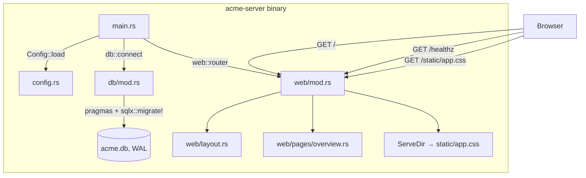
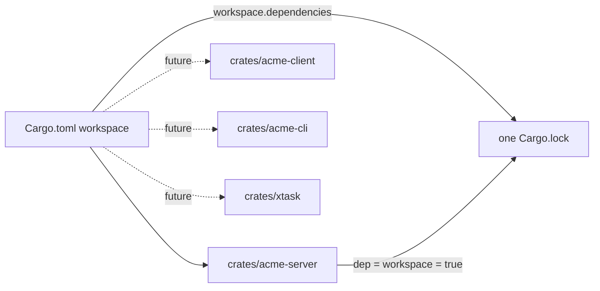
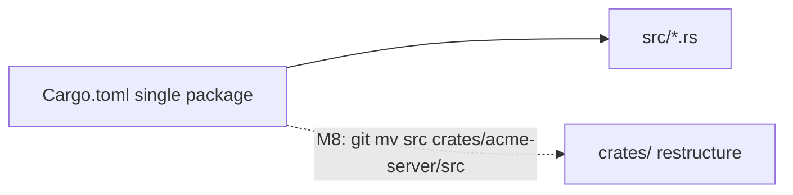

<!-- Instance of SPEC_TEMPLATE.md — see specs/SPEC_TEMPLATE.md -->

# Feature Spec: Scaffolding (M0 — Skeleton)

**Ticket Nº**: N/A — internal milestone, tracked as M0 in specs/000-Initial-Spec.md §20

## Objective

Stand up the `acme` project skeleton described as milestone **M0** in
specs/000-Initial-Spec.md §20: a Cargo project that serves a styled, empty
dashboard with `cargo run`, with the plumbing (config, tracing, DB pool,
migrations, static assets) in place for M1 to build the real domain on top
of.

### Details

Implemented, all under a new Cargo workspace (see Proposals, Option A):

- **Workspace scaffold**: root `Cargo.toml` as `[workspace]` with
  `[workspace.dependencies]` pinning every crate/version from spec §3 (used
  or not yet), and `crates/acme-server` as the sole member, building the
  `acme` binary.
- **Config** (`config.rs`): `Config` struct covering every setting from
  spec §6, loaded via `figment` — defaults, then optional `acme.toml`, then
  `ACME_`-prefixed env vars.
- **Tracing**: `tracing-subscriber` initialized from `Config::log`
  (`ACME_LOG`, default `info,acme=debug`).
- **DB** (`db/mod.rs`): SQLite pool via `sqlx`, pragmas from spec §7
  (`journal_mode=WAL`, `synchronous=NORMAL`, `foreign_keys=ON`,
  `busy_timeout=5000`, `temp_store=MEMORY`) applied per-connection through
  `SqliteConnectOptions`, then `sqlx::migrate!` runs pending migrations.
- **Migrations**: one placeholder (`20260101000001_init.sql`, a
  `schema_meta` table) proving the pool+migrate path; the full schema from
  spec §7 is out of scope here (M1).
- **Routes**: `GET /healthz` (JSON status), `GET /` (dashboard overview),
  `/static/*` served from `crates/acme-server/static` via `ServeDir`.
- **Dashboard shell**: Maud `layout()` with header (brand, nav, sim-clock
  readout) rendering `Config::clock_epoch` as static RFC3339 text — no
  `SimClock`/ticker yet (M1) — plus one `overview` page and a
  hand-written `app.css`.
- **Graceful shutdown**: `main.rs` awaits `SIGINT`/`SIGTERM` before
  returning from `axum::serve`.
- **Docs and process**: `.agents/docs/*` (distilled reference from the
  product spec), `.agents/skills/software-engineer/` (skill + refs),
  `AGENTS.md` (rules + M0 implementation learnings), `Justfile` (`run`,
  `watch`, `test` via nextest, `fmt`, `lint`, plus forward-declared `seed`/
  `reset`/`openapi` recipes for milestones that don't exist yet).

Out of scope for M0 (left for later milestones per spec §20): full schema,
domain state machines, sim clock/ticker, request-logging middleware,
provider adapters, webhooks, the dashboard's real pages, CLI subcommands
beyond the default `serve`.

## Prior Art

specs/000-Initial-Spec.md is the only prior art — this spec documents the
implementation of its M0 row (§20), following its architecture (§4),
repository layout (§5), configuration table (§6), data model conventions
(§7), and build/run expectations (§19). The workspace layout additionally
pulls forward the restructure described in §22.1, normally an M8 concern —
see Option A below.

## Tech Stack

| Crate                            | Role in M0                                           |
| -------------------------------- | ---------------------------------------------------- |
| `axum`                           | HTTP server, routing (`/`, `/healthz`, `/static/*`)  |
| `tokio`                          | Async runtime, signal handling for graceful shutdown |
| `tower`, `tower-http`            | `TraceLayer`, `CompressionLayer`, `ServeDir`         |
| `maud`                           | Server-rendered HTML (`layout`, `overview` page)     |
| `sqlx`                           | SQLite pool, connection pragmas, migrations          |
| `serde`, `serde_json`            | Config (de)serialization, `/healthz` JSON body       |
| `chrono`                         | `DateTime<Utc>` for `Config::clock_epoch`            |
| `tracing`, `tracing-subscriber`  | Structured logs, `ACME_LOG` env filter               |
| `thiserror` _(declared, unused)_ | Reserved for `domain`/`db::repo` errors, M1          |
| `anyhow`                         | `main`'s `Result`, `AppError`, `Config::load`        |
| `figment`                        | Config loading: defaults → `acme.toml` → env         |

Every other crate from spec §3 (`utoipa*`, `serde_qs`, `fake`, `rand`,
`ulid`, `hmac`/`sha2`/`base64`/`hex`, `reqwest`, `insta`, `axum-test`) is
pinned in `[workspace.dependencies]` but not yet referenced by any crate —
see [[.agents/docs/tech-stack.md]] and the "declaring the entire stack up
front" learning in `AGENTS.md`.

### Caveats

- `sqlx::query!`/`query_as!` (compile-time verified) are avoided in favor
  of the runtime `sqlx::query()`/`query_as::<_, T>()` API — no `.sqlx`
  offline cache exists yet, and per this repo's convention the agent
  implementing this milestone doesn't run `cargo build` to generate one.
  See `AGENTS.md` → Hard rules.
- The `schema_meta` migration is a placeholder, not real schema — anything
  depending on `payments`/`shipments`/etc. tables has nothing to query yet.
- `AppState.db` is currently unread by any handler (`#[allow(dead_code)]`)
  — every route so far is static/health-check only.
- `Justfile` recipes `seed`, `reset`, `openapi` reference CLI subcommands
  the binary doesn't parse yet (`main.rs` only ever runs the default serve
  path); they document the target interface from spec §19 ahead of the
  milestone that implements them.

### Future Improvements

M1 per spec §20: full schema (§7), `domain::{payment,shipment}` state
machines with exhaustive tests, `SimClock` + `sim::ticker`, event log,
request-logging middleware (§8.6), the real `AcmeError` enum (§8.5). At
that point the dashboard's clock header switches from `Config::clock_epoch`
static text to a live `SimClock::now()` read.

## Technical Details

### Current State

Request path for `GET /`: `web::router` → `overview` handler → reads
`AppState.cfg.clock_epoch` → `pages::overview::render` → `web::layout::layout`
→ `Markup` → `IntoResponse`. No DB read on this path yet.

## Proposal/s

### Option A: Cargo workspace from M0 (chosen, implemented)

#### Introduction

Restructure the repo as a Cargo workspace at M0 instead of at M8 (spec
§22.1's original trigger point), with `crates/acme-server` as the first
member and every crate/version from spec §3 centralized in
`[workspace.dependencies]` from day one.

#### Details

#### Testing Strategy

- **Unit**: none required for scaffolding itself; `Config::default()`/`load()`
  are pure enough to unit test in M1 once config gets more branching logic.
- **Integration**: M1 adds `axum-test`-based route tests once routes do
  real work; M0's `/healthz` and `/` are thin enough that a manual
  `cargo run` + browser check is the verification (done — see AGENTS.md
  learnings for the dead-code-field fix that came from that check).
- **E2E**: `tests/scenarios.rs` (spec §17) starts at M2, once Acme Pay/Ship
  exist end to end.

#### Acceptance Criteria

|       |                                                                                                                                                     |
| ----- | --------------------------------------------------------------------------------------------------------------------------------------------------- |
| Given | A fresh clone of the repo with no prior build artifacts                                                                                             |
| When  | The developer runs `just run` (`cargo run -p acme-server`)                                                                                          |
| Then  | The binary compiles as part of a Cargo workspace, migrates a fresh `acme.db`, and serves a styled dashboard on `ACME_BIND` (default `0.0.0.0:8080`) |
| And   | `GET /healthz` returns `{"status":"ok"}`, and `GET /` renders the header's sim-clock readout as static RFC3339 text                                 |

#### Open Questions / Risks

##### Does pulling the workspace restructure into M0 cost anything spec §22.1 assumed would be deferred?

No functional cost. `[workspace.dependencies]` entries are only
resolved/fetched once a member crate references them with
`workspace = true`, so declaring the full spec §3 stack up front doesn't
pull in unused dependencies or slow the build. The only "cost" is that
`crates/acme-server/` is one path segment deeper than spec §5's literal
`acme/src/` layout — noted in `.agents/docs/architecture.md` so later
sections of the spec that assume the flat layout are read with that
adjustment in mind.

##### Will `crates/acme-client`, `acme-cli`, `xtask` be added before their milestone (spec §22, M8+)?

No — `AGENTS.md` and `.agents/docs/conventions.md` explicitly call out not
scaffolding those crates speculatively; they get added when M5–M7 land and
`acme-client` generation (spec §22.2) actually starts.

### Option B: Single crate at repo root, defer workspace to M8 (rejected)

#### Introduction

Follow specs/000-Initial-Spec.md §5 literally: `acme/src/...` as a single
non-workspace crate through M0–M7, and only introduce `[workspace]` /
`crates/acme-server/` at M8 when `acme-client` is extracted, exactly as
§22.1 describes.

#### Details

#### Testing Strategy

Same as Option A for M0–M7 (nothing workspace-specific to test either way);
diverges only at the M8 restructure, which would then need its own
migration-safety check (do all relative paths — `ServeDir`,
`sqlx::migrate!` — still resolve after `git mv`).

#### Acceptance Criteria

|       |                                                                                             |
| ----- | ------------------------------------------------------------------------------------------- |
| Given | A fresh clone of the repo with no prior build artifacts                                     |
| When  | The developer runs `just run` (`cargo run`, single package)                                 |
| Then  | The binary compiles as a standalone package and serves the same M0 dashboard                |
| And   | At M8, `crates/` is introduced in one dedicated migration commit rather than from the start |

#### Open Questions / Risks

##### Why was this rejected in favor of Option A?

Because M8's restructure would be a mechanical `git mv` plus
`[workspace.dependencies]` extraction touching every existing file's
`Cargo.toml`/import assumptions at once, on top of whatever M1–M7 work is
current at that point — strictly more disruptive than starting flat.
Option A pays that one-time cost on an empty skeleton instead, and gets
shared-compilation benefits (one `Cargo.lock`, one `target/`) for the
entire M1–M7 build-out, not just from M8 onward.
