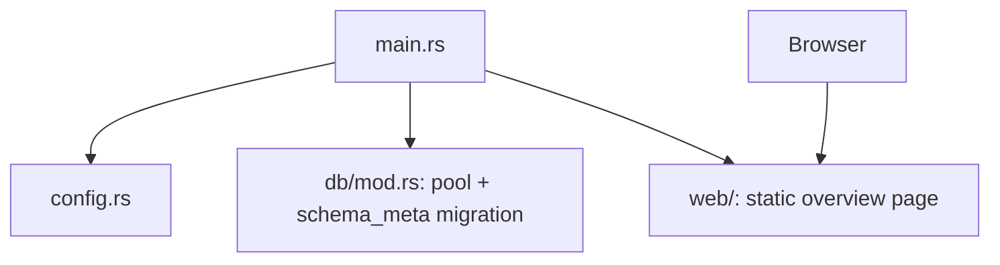
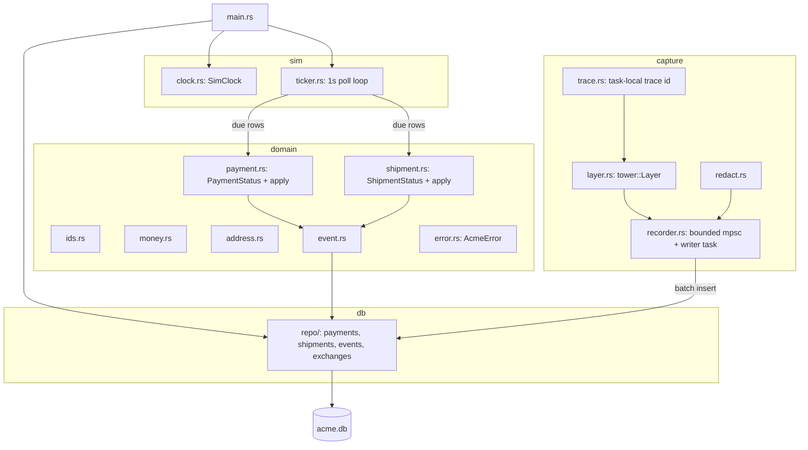
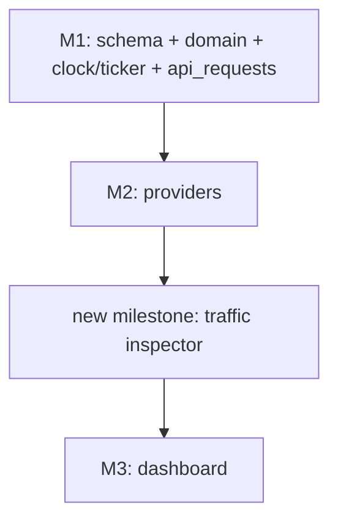

<!-- Instance of SPEC_TEMPLATE.md — see specs/SPEC_TEMPLATE.md -->

# Feature Spec: Core (M1)

**Ticket Nº**: N/A

## Objective

Implement milestone **M1 — Core** from specs/000-Initial-Spec.md §20: the
full data model, the domain primitives (ids, money, addresses), both
state machines with exhaustive tests, the simulation clock and ticker, the
event log, the inbound half of the request-logging/traffic-inspector
pipeline (§8.6, repriced into M1 by §21.14), and the `AcmeError` enum.

Done when, per §20 and §21.14: a hand-inserted shipment, advanced by the
ticker, reaches `delivered`; every state-machine transition test is green;
and the capture pipeline records an exchange end to end without ever
blocking or failing the request that caused it.

### Details

In scope:

1. **Full schema** (spec §7) via sqlx migrations: tenancy/catalog
   (`merchants`, `providers`, `api_credentials`), commerce (`customers`,
   `addresses`, `orders`, `order_items`), payments (`payments`,
   `checkout_sessions`, `payment_events`, `refunds`, `disputes`,
   `card_tokens`), shipping (`rate_quotes`, `rate_options`, `shipments`,
   `shipment_packages`, `shipment_events`, `pickups`, `coverage`), and
   platform tables (`events`, `webhook_endpoints`, `webhook_deliveries`,
   `idempotency_keys`, `sim_settings`, `sim_faults`). Full DDL already
   catalogued in `.agents/docs/data-model.md` §7.1–7.5.
2. **Traffic inspector schema and inbound capture** (spec §21.1–21.6,
   pulled into M1 by §21.14): `http_bodies`, `http_exchanges`,
   `exchange_resources`; the `Recorder`/writer-task pipeline; redaction;
   trace-id propagation. `webhook_deliveries`'s per-attempt HTTP columns
   are dropped in favor of `http_exchanges` per §21.1 — the M0 migration's
   `webhook_deliveries` sketch is superseded here.
3. **Domain primitives**: `domain::ids` (prefixed ULIDs), `domain::money`
   (`Money { cents: i64, currency: Currency }`), `domain::address`.
4. **Both state machines** (spec §8.1, §8.2): `PaymentStatus`,
   `ShipmentStatus`, their transition tables, `DeclineReason`, and the
   shipment happy-path event-schedule generator.
5. **Sim clock and ticker** (spec §8.3): `SimClock`, persisted seed in
   `sim_settings`, `sim::ticker` background task polling
   `next_transition_at`.
6. **Event log**: `payment_events`/`shipment_events` per-resource logs plus
   the cross-resource `events` table (spec §7.5), written by the ticker and
   (in M2+) by provider handlers.
7. **`AcmeError`** (spec §8.5): the enum, plus one `IntoResponse` rendering
   using Acme Pay's own JSON envelope — the only dialect that exists before
   M2. Per-dialect rendering is added provider-by-provider from M2 on.

Out of scope (explicitly scheduled for later milestones by §20/§21.14):
idempotency _behavior_ (table exists, middleware is M2), scenario/magic-value
application (M2/M5), pricing engine (M2), outbound webhook capture (M4),
dashboard traffic pages and SSE live tail (M3), fault injection (M6),
`/metrics` Prometheus endpoint (§16, unscheduled — see Open Questions).

## Prior Art

specs/000-Initial-Spec.md §7 (data model), §8 (core domain), §16
(observability), §17 (testing), §20 (delivery plan), §21.1–§21.7 and
§21.14 (traffic inspector, and its repricing into M1). specs/001-Scaffolding.md
for the M0 baseline this milestone builds on. `.agents/docs/domain.md`,
`.agents/docs/data-model.md`, `.agents/docs/architecture.md` for the
already-distilled reference material.

## Tech Stack

| Crate            | Role in M1                                                          | Status                           |
| ---------------- | ------------------------------------------------------------------- | -------------------------------- |
| `sqlx`           | Repo queries (`db::repo::{payments,shipments,events}`), migrations  | already pinned (M0)              |
| `chrono`         | `SimClock`, all RFC3339 text timestamps                             | already pinned (M0)              |
| `ulid`           | `domain::ids` prefixed identifiers                                  | pinned, first use                |
| `thiserror`      | `AcmeError`, `DomainError`                                          | pinned, first use                |
| `tokio`          | `sim::ticker` interval task, `CancellationToken` (via `tokio-util`) | already pinned; add `tokio-util` |
| `sha2`, `hex`    | Content-addressed `http_bodies.id` (sha256 hex)                     | already pinned (M0), first use   |
| `tower`          | `capture::layer` as a `tower::Layer`                                | already pinned (M0)              |
| `regex`          | Redaction rules (§21.5)                                             | **new** — not in spec §3's table |
| `http-body-util` | `Limited` body buffering during inbound capture (§21.6)             | **new** — not in spec §3's table |

### Caveats

- Spec §21.6 calls `metrics::counter!("acme_traffic_dropped_total")`, but
  no metrics crate is in spec §3's table and `/metrics` itself is
  unscheduled (§16 doesn't carry a milestone tag). M1 implements the drop
  counter as a plain `AtomicU64` behind a getter, sufficient for the
  §21.13 test ("fill the recorder channel, assert the counter
  increments"), and swaps it for `metrics`/`metrics-exporter-prometheus`
  whichever milestone wires up `/metrics`.
- `regex` and `http-body-util` are additions beyond spec §3's pinned list.
  Both get added to root `[workspace.dependencies]` rather than
  repinned per-crate, consistent with the M0 workspace convention.
- The inbound capture `tower::Layer` has nothing real to wrap in M1 — no
  provider router exists until M2. It's built and tested against a
  synthetic router (see Testing Strategy) and mounted onto real provider
  routers starting M2.
- `sim_settings` seeding must not clobber a prior run's dashboard-adjusted
  clock/multiplier on every restart. See Technical Details for the
  seed-once design.

### Future Improvements

M2 mounts the capture layer on `/acmepay` and `/acmeship`, adds the
idempotency middleware against the now-existing `idempotency_keys` table,
and wires `domain::scenario` magic-value matching. M3 adds the SSE
subscriber to the writer task's broadcast channel and the dashboard's
Traffic pages. M4 adds outbound capture inside `webhooks::dispatcher`.

## Technical Details

### Current State

M0 (specs/001-Scaffolding.md) ships a Cargo workspace with one crate,
`acme-server`: config, tracing, a SQLite pool with pragmas, one placeholder
migration (`schema_meta`), `/healthz`, static file serving, and a Maud
dashboard shell whose header renders `Config::clock_epoch` as static text.
No domain types, no background tasks, no request capture exist yet.

## Proposal/s

### Option A: Build M1 exactly as repriced by §21.14 (chosen)

#### Introduction

Implement M1 as the delivery plan's own §21.14 update describes it: the
literal §20 M1 scope (schema, domain primitives, both state machines, sim
clock/ticker, event log, error enum) _plus_ the traffic inspector's schema
and inbound-only capture pipeline, moved earlier because — as §21.14 puts
it — "it is the tool used to build everything after it." The capture layer
is built and tested standalone in M1, then mounted onto real provider
routers starting M2.

#### Details

`sim::ticker` on each 1s wall-clock tick:

1. `clock.now()` → current sim time.
2. `SELECT * FROM payments WHERE next_transition_at <= ?1` and the
   equivalent for `shipments` (both already indexed, spec §7.3/§7.4).
3. For each due row, call `domain::payment::apply` /
   `domain::shipment::apply` with the scheduled command, write the
   resulting `payment_events`/`shipment_events` row, update
   `status`/`next_transition_at`, and insert an `events` row.
4. Ticker lag (wall time behind where sim time should be) is exposed via
   a getter for M1's own tests; the dashboard amber-alarm UI (§16) is M3+.

`sim_settings` is seeded once: on boot, `INSERT INTO sim_settings (...)
SELECT ... WHERE NOT EXISTS (SELECT 1 FROM sim_settings)`, sourced from
`Config`. A restart never resets a dashboard-adjusted clock — matching
spec §6's "env vars only provide their initial values."

#### Testing Strategy

| Layer                | Approach                                                                                                                                                                                                                                                                                                                                                                                                                                                    |
| -------------------- | ----------------------------------------------------------------------------------------------------------------------------------------------------------------------------------------------------------------------------------------------------------------------------------------------------------------------------------------------------------------------------------------------------------------------------------------------------------- |
| State machines       | Exhaustive table test over every `(PaymentStatus, PaymentCommand)` and `(ShipmentStatus, ShipmentCommand)` pair (11×N and 14×N grids — small enough to enumerate directly, no `proptest` dependency needed); a second test does a breadth-first walk from `Created`/`Quoted` over all legal transitions and asserts every reachable state is one of the enum's variants and every terminal state (`is_terminal() == true`) has no outgoing legal transition |
| Repositories         | `#[sqlx::test]` per repo function against a fresh temp SQLite database                                                                                                                                                                                                                                                                                                                                                                                      |
| Ticker               | Insert a shipment row by hand with `next_transition_at` in the past, call `sim::ticker::tick(&pool, &clock)` directly (not the spawned loop) in a loop bounded by an iteration cap, assert the row reaches `delivered` and `shipment_events` has one row per hop in the happy-path schedule                                                                                                                                                                 |
| Capture pipeline     | `axum-test` against a throwaway `Router` with two dummy handlers (200 and 500) wrapped in `capture::layer`; assert `http_exchanges`/`http_bodies` rows appear with correct `outcome`, `status_code`, `search_key`                                                                                                                                                                                                                                           |
| Capture never blocks | Fill the bounded channel (capacity 4096) synthetically, send one more `Exchange`, assert `record()` returns immediately and the drop counter increments (§21.13 criterion 6, pulled into M1)                                                                                                                                                                                                                                                                |
| Redaction            | Table test over §21.5's four rules: header last-4 masking, JSON/form key regex, Luhn-passing digit runs, oversized `label`/`qr_code_base64` fields; assert a body with none of these is untouched                                                                                                                                                                                                                                                           |
| Money/ids            | Unit tests: `Money` arithmetic never uses float ops; prefixed ULID round-trips through `Display`/`FromStr`/`sqlx::Type`                                                                                                                                                                                                                                                                                                                                     |

E2E (`tests/scenarios.rs`, spec §17) is not possible yet — it needs Acme
Pay/Ship, which land in M2.

#### Acceptance Criteria

|       |                                                                                                                                                                                                                                                                                                                        |
| ----- | ---------------------------------------------------------------------------------------------------------------------------------------------------------------------------------------------------------------------------------------------------------------------------------------------------------------------- |
| Given | A fresh `acme.db`, migrated, with one shipment row hand-inserted at `created` and `next_transition_at` in the past                                                                                                                                                                                                     |
| When  | `sim::ticker::tick` runs repeatedly (or the spawned ticker task runs under an accelerated `SimClock`)                                                                                                                                                                                                                  |
| Then  | The shipment reaches `delivered`, with one `shipment_events` row per hop in the happy-path schedule and matching `events` rows                                                                                                                                                                                         |
| And   | Every `(status, command)` pair in both state machines' exhaustive tests passes, illegal transitions return `Err(DomainError)` rather than panicking, and a synthetic request through `capture::layer` produces a correctly-populated `http_exchanges`/`http_bodies` pair without ever blocking or failing that request |

#### Open Questions / Risks

##### Is it safe to build the inbound capture layer before any provider route exists to mount it on?

Yes — §21.14 explicitly schedules exactly this ("the inbound layer lands
here rather than as a detail of §8.6"), and the layer's correctness
(redaction, trace propagation, non-blocking recording) is fully testable
against a synthetic router. Mounting it on `/acmepay`/`/acmeship` in M2 is
then a one-line `.layer(capture::layer())` addition, not new design work.

##### Where does the `metrics` crate gap get resolved?

Not in M1. The `AtomicU64` drop counter satisfies M1's own acceptance
criterion (§21.13 #6). Whichever milestone implements `/metrics` (§16 has
no milestone tag in §20; likely M7 "polish") adds `metrics` +
`metrics-exporter-prometheus` to `[workspace.dependencies]` and swaps the
counter's implementation then — tracked as a note in that milestone's own
spec when it's written, not solved speculatively here.

##### Does `webhook_deliveries` still need its own row shape now that `http_exchanges` absorbs the per-attempt HTTP fields?

Per spec §21.1, yes but slimmed: `webhook_deliveries` keeps the
_delivery-intent_ columns (`endpoint_id`, `event_id`, `attempt`,
`max_attempts`, `status`, `next_attempt_at`) and drops any per-attempt HTTP
detail columns in favor of `last_exchange_id` pointing into
`http_exchanges`. The table is created in M1 (full schema), but stays
unused until M4 builds the dispatcher that writes to it.

### Option B: Defer all of §21 to a dedicated post-M2 milestone (rejected)

#### Introduction

Keep M1 to spec §20's original, pre-§21.14 wording only — schema, domain
primitives, both state machines, sim clock/ticker, event log, a minimal
request-logging middleware (writing directly to a simpler `api_requests`
table as originally sketched in §7.5), and `AcmeError`. Build the full
`http_exchanges`/`http_bodies` traffic inspector later, once M2's provider
routes exist to generate traffic worth inspecting.

#### Details

#### Testing Strategy

Same as Option A for schema/domain/clock/ticker. `api_requests` middleware
tested the way §8.6 originally described it, standalone, without the
trace/redaction/body-store machinery.

#### Acceptance Criteria

|       |                                                                                                                                |
| ----- | ------------------------------------------------------------------------------------------------------------------------------ |
| Given | The same hand-inserted-shipment scenario as Option A                                                                           |
| When  | The ticker runs                                                                                                                |
| Then  | Same outcome as Option A for the state-machine/ticker portion                                                                  |
| And   | No `http_exchanges`/`http_bodies` schema or capture pipeline exists yet; `api_requests` is a simpler, single-table request log |

#### Open Questions / Risks

##### Why was this rejected?

Because it directly contradicts specs/000-Initial-Spec.md §21.14, which
already revised §20 to move the inspector's schema and inbound capture
into M1 — Option B would mean implementing `api_requests` now and then
throwing it away for `http_exchanges` immediately after M2, doing the
redaction/trace design twice under more time pressure (concurrently with
five dialect adapters in M5) instead of once against a quiet, provider-free
codebase. The spec's own stated reason stands: "every milestone after M1
gets faster because failures become self-explaining" — that benefit is
lost for all of M2 if capture arrives after it instead of before.
