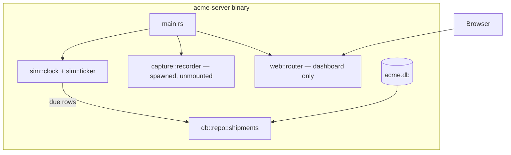
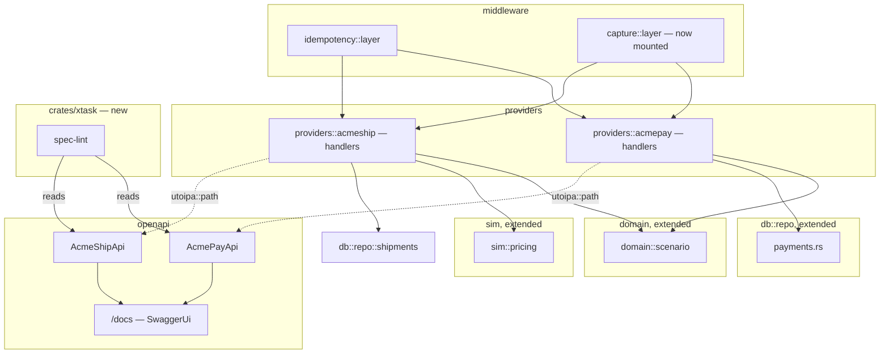
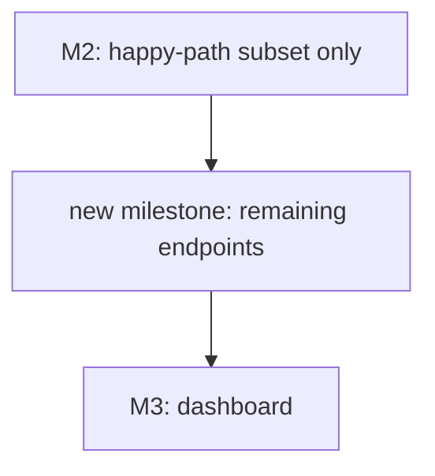

<!-- Instance of SPEC_TEMPLATE.md — see specs/SPEC_TEMPLATE.md -->

# Feature Spec: First Vertical Slice (M2)

**Ticket Nº**: N/A — internal milestone, tracked as M2 in specs/000-Initial-Spec.md §20

## Objective

Implement milestone **M2 — First vertical slice** from specs/000-Initial-Spec.md
§20: Acme Pay and Acme Ship, the two "house style" reference dialects, end
to end over the domain M1 already built — plus idempotency, the pricing
engine, scenario/magic-value handling, and OpenAPI/Swagger UI for both
providers, built under the §22.3 generator-friendly rules (`operation_id`,
named schemas, descriptions, typed error responses) and a spec-lint check
in CI, pulled forward into M2 by §22.14 rather than left for M8.

Done when, per §20 and §22.14: `tests/scenarios.rs` passes the full
quote → pay → label → tracking journey for one merchant; Swagger UI's
"Try it out" creates a payment on the first click; and `cargo xtask
spec-lint` (new in this milestone) fails the build if a route is missing
an `operation_id`, an inline anonymous schema, or an undescribed field.

### Details

In scope:

1. **`domain::scenario`** (spec §9.1/§9.2): magic-value matching on the
   inbound request — card PAN, amount's last two minor-unit digits, payer
   email for payments; destination postal code, package dimensions,
   declared value, recipient name, order reference for shipments — plus
   the explicit `metadata.acme_scenario` / `X-Acme-Scenario` override,
   which always wins. Returns a `Scenario` enum consumed by the Acme Pay
   and Acme Ship handlers to pick the `PaymentCommand`/`ShipmentCommand`
   (and `next_transition_at`) the M1 state machines already know how to
   apply. Fault-rule injection (§9.3) stays out of scope — no dashboard
   exists yet to configure it (M6).
2. **`sim::pricing`** (spec §11.7): the deterministic billable-weight /
   zone / surcharge formula, one zone matrix (**ES**, matching the
   worked Madrid→Alicante example in §11.1/§8.2) and Acme Ship's own
   tariff table (`base_cents`, `included_kg`, `per_step_cents`,
   `services`). Other matrices (CL, BR, international) are added
   provider-by-provider in M5 when a carrier actually needs them.
3. **Idempotency middleware** (spec §8.4): a tower middleware keyed on
   `Acme-Idempotency-Key`, hashing the canonicalized body, backed by the
   already-migrated `idempotency_keys` table (M1 schema, unused until
   now).
4. **`db::repo::payments`**: the payments-side counterpart to M1's
   `db::repo::shipments` — `payments`, `checkout_sessions`,
   `payment_events`, `refunds`, `card_tokens` — following the same
   "writes the event-log row in the same transaction" rule.
5. **Acme Pay** (`/acmepay/v1`, spec §10.1): every documented endpoint —
   payments (create/get/list/capture/cancel/refunds), checkout sessions,
   the event log, webhook-endpoint registration (CRUD only; the dispatcher
   that actually delivers to them is M4), payment methods catalog.
6. **Acme Ship** (`/acmeship/v1`, spec §11.1): every documented endpoint —
   rates, shipments (create/get/list/label/tracking/cancel), public
   tracking (no auth), pickups, returns, coverage, service catalog.
7. **OpenAPI + Swagger UI** (spec §14, with the §22.3 rules pulled
   forward): `utoipa-axum` `OpenApiRouter` per provider, mounted at
   `/openapi/{acmepay,acmeship}.json`, combined spec, `SwaggerUi` at
   `/docs`. Every operation gets an explicit snake_case `operation_id`;
   every request/response schema is a named component; every operation,
   parameter and field carries a `description`; `AcmeError`'s per-status
   bodies are declared as typed responses (§8.5's envelope, already
   implemented in M1's `error.rs`).
8. **`cargo xtask spec-lint`** (new `xtask` member, spec §22.1's
   restructure pulled forward for this one binary/lint only — not the
   rest of §22): walks the two providers' generated `utoipa::openapi::OpenApi`
   in-process and fails with a line-numbered-by-route report if any
   operation lacks an `operation_id`, any schema is an inline object
   nested more than zero levels deep, or any field/parameter/operation
   lacks a `description`. Wired into `just lint` and CI.
9. **`tests/scenarios.rs`** (spec §17): drives the sim clock manually
   through quote → create shipment → label → tracking → delivered, and
   create payment → captured, for one seeded merchant, asserting against
   both HTTP responses and the underlying rows.
10. **Mount `capture::layer::record_exchange`** on both provider routers —
    the M1 caveat's "one-line `.layer(...)` addition", now that a real
    router exists to mount it on. `AppState.db`'s `#[allow(dead_code)]`
    and `AppState.recorder`'s `#[allow(dead_code)]` come off.

Out of scope (explicitly scheduled for later milestones by §20/§22.14):
the other eight provider dialects and their per-dialect error/pagination/
auth quirks (M5); webhook _delivery_ — signing, retries, the dispatcher
(M4); fault injection and its dashboard (M6); the dashboard's payments/
shipments/requests pages (M3, though `/docs` and raw `/openapi/*.json`
are reachable now); `acme-client`/`acme-cli`/the rest of `xtask` (M8,
per §22.14 "M8 depends only on M2 and M4" — this milestone only adds the
one `spec-lint` binary early); rate limiting and fault-rule modes beyond
what `AcmeError::RateLimited`/`ProviderDown` already model structurally.

## Prior Art

specs/000-Initial-Spec.md §8.4 (idempotency), §9 (scenarios), §10.1 (Acme
Pay), §11.1/§11.7 (Acme Ship, pricing), §14 (OpenAPI/Swagger), §17
(testing), §20 (delivery plan and per-provider definition of done), §22.3
and §22.14 (spec-generator-friendliness rules and their repricing into
M2). specs/002-Core.md for the M1 baseline this milestone builds on:
schema, domain primitives, both state machines, `SimClock`/ticker, event
log, `AcmeError`'s Acme-Pay-envelope rendering, and the inbound capture
layer built standalone against a synthetic router.

## Tech Stack

| Crate               | Role in M2                                                                   | Status                                                                                    |
| ------------------- | ---------------------------------------------------------------------------- | ----------------------------------------------------------------------------------------- |
| `utoipa`            | `#[derive(ToSchema)]`, `#[utoipa::path(...)]` annotations                    | pinned (M0), first use                                                                    |
| `utoipa-axum`       | `OpenApiRouter`/`routes!` so handler and spec cannot diverge                 | pinned (M0), first use                                                                    |
| `utoipa-swagger-ui` | `/docs`                                                                      | pinned (M0), first use                                                                    |
| `serde_qs`          | List-endpoint query strings (`?status=&created_after=&limit=`)               | pinned (M0), first use                                                                    |
| `sqlx`              | `db::repo::payments`                                                         | already in use (M1)                                                                       |
| `tower`             | Idempotency middleware as a second `tower::Layer` alongside `capture::layer` | already in use (M1)                                                                       |
| `insta`             | Dialect-adapter response snapshots, OpenAPI spec snapshots                   | pinned (M0), first use — **add to `acme-server`'s `[dev-dependencies]`**, not yet present |
| `axum-test`         | `tests/scenarios.rs`, per-endpoint integration tests                         | already in use (M1, synthetic-router capture tests)                                       |

### Caveats

- `acme-server/Cargo.toml` currently lists neither `utoipa`, `utoipa-axum`,
  `utoipa-swagger-ui`, `serde_qs`, nor `insta` under `[dependencies]`/
  `[dev-dependencies]`, even though all five are pinned in the root
  `[workspace.dependencies]` since M0. Adding them is this milestone's
  first commit, mechanically — see M0's own note that unused workspace
  entries cost nothing until referenced.
- `cargo xtask spec-lint` is a genuine `[workspace]` member addition
  (`crates/xtask`), which is technically part of §22.1's restructure.
  Scope is deliberately narrowed to _only_ the lint binary — no
  `progenitor`, no `codegen`, no `acme-client` scaffold — because §22.3's
  four generator-friendliness rules are cheapest to enforce "while there
  are only two providers to fix, rather than ten" (§22.14's own words),
  and CI needs a command to run, not just a convention to remember.
- Acme Ship's tariff table and the ES zone matrix are invented numbers
  calibrated only to make §11.7's worked example (Madrid→Alicante,
  standard service, €5.59) reproduce exactly — they are not meant to
  survive contact with a second country without recalibration, which is
  why M5 owns the CL/BR/international matrices rather than this
  milestone guessing at them early.
- Checkout-session hosted-page rendering (§13.7, "hosted checkout pages")
  is a dashboard/Maud concern tagged M5 in §20's row for that milestone;
  M2 implements `checkout_sessions`' CRUD API surface (create, retrieve,
  expire) but `hosted_url` in this milestone points at a `501`
  placeholder page, not a working fake checkout UI.

### Future Improvements

M3 mounts a dashboard on top of the tables this milestone starts writing
for real (payments, shipments, checkout_sessions) instead of the
hand-inserted rows M1's ticker tests used. M4 adds the webhook dispatcher
that actually delivers to the endpoints M2 lets a caller register. M5
reuses `domain::scenario`, `sim::pricing`'s shape, and the `spec-lint`
gate for eight more dialects. M8 grows `crates/xtask` from "one lint
binary" into the full spec-export/codegen/drift-check tool §22.2
describes, and extracts `acme-client`.

## Technical Details

### Current State

M1 shipped the full schema, both state machines, the sim clock/ticker,
`db::repo::shipments`, the event log, `AcmeError` with Acme Pay's own
envelope, and the inbound capture middleware — proven only against a
synthetic `axum-test` router (`tests/capture.rs`), never mounted on
`state::router` in `lib.rs`. There is no `db::repo::payments`, no HTTP
route under `/acmepay` or `/acmeship`, no OpenAPI document, and
`AppState.db`/`AppState.recorder` are both `#[allow(dead_code)]` because
nothing reads them yet outside tests.

## Proposal/s

### Option A: Build M2 exactly as §20 scopes it, with §22.3's rules and spec-lint pulled forward per §22.14 (chosen)

#### Introduction

Implement the full endpoint surface of both reference dialects (§10.1,
§11.1) as the literal M2 row describes, wire idempotency and pricing
against them, and additionally apply §22.3's four client-generation
rules from the first `#[utoipa::path]` written — plus the `spec-lint`
check that enforces them in CI — exactly as §22.14 prescribes ("establish
the rules while there are only two providers to fix... add the spec-lint
to CI now").

#### Details

Request path for `POST /acmepay/v1/payments`: `capture::layer` (buffers

- redacts, unchanged from M1) → `idempotency::layer` (hash body, check
  `idempotency_keys`, short-circuit on replay) → handler → `domain::scenario`
  picks the outcome from the PAN/amount/email → `domain::payment::apply`
  (M1, unchanged) → `db::repo::payments` writes `payments` +
  `payment_events` + `events` in one transaction → `AcmeError`/`Payment`
  `IntoResponse`.

`POST /acmeship/v1/shipments`: same shape, with `sim::pricing::quote`
computing `amount_cents` from the tariff table before `domain::shipment`'s
happy-path schedule generator (M1, unchanged) seeds `next_transition_at`.

#### Testing Strategy

| Layer                | Approach                                                                                                                                                                                                                                                                   |
| -------------------- | -------------------------------------------------------------------------------------------------------------------------------------------------------------------------------------------------------------------------------------------------------------------------- |
| `domain::scenario`   | Table test over every row in spec §9.1/§9.2, asserting the matched `Scenario` variant; a test asserting the explicit override always wins over any magic value present in the same request                                                                                 |
| `sim::pricing`       | Golden test reproducing §11.7's worked example (Madrid→Alicante, standard, `amount = 559`, `billable_weight_grams = 1980`) exactly; a property test that price is monotonic in weight and in zone number                                                                   |
| `db::repo::payments` | `#[sqlx::test]` per function against a fresh temp SQLite database, mirroring M1's `db::repo::shipments` pattern                                                                                                                                                            |
| Idempotency          | Concurrent duplicate-submission test (two tasks racing the same key) asserting exactly one `payments` row and byte-identical response bodies; a second test asserting a reused key with a different body hash gets the dialect's own 409/400                               |
| Dialect adapters     | One `axum-test`-driven integration file per provider (`tests/acmepay.rs`, `tests/acmeship.rs`), asserting exact response bodies against `insta` snapshots for create/retrieve/list, one failure path, and the terminal state — spec §17's "the snapshots are the contract" |
| OpenAPI              | `tests/openapi_snapshot.rs`, an `insta` snapshot per provider spec; `cargo xtask spec-lint` run as its own CI step, not folded into `cargo test`, so a lint failure reports as a distinct, readable CI job rather than a panicking Rust test                               |
| E2E                  | `tests/scenarios.rs`: one seeded merchant, clock driven manually, quote → create shipment → label → tracking → delivered, and create payment → captured, asserting HTTP responses and underlying rows agree at each step                                                   |

#### Acceptance Criteria

|       |                                                                                                                                                                                                                                                                                                               |
| ----- | ------------------------------------------------------------------------------------------------------------------------------------------------------------------------------------------------------------------------------------------------------------------------------------------------------------- |
| Given | A fresh, migrated `acme.db` seeded with one merchant, one `acmepay` credential, and one `acmeship` credential                                                                                                                                                                                                 |
| When  | `tests/scenarios.rs` runs the full quote → pay → label → tracking journey against the running router, driving the sim clock by hand between steps                                                                                                                                                             |
| Then  | Every HTTP call in the journey returns the documented status and body shape, the payment reaches `captured` and the shipment reaches `delivered`, and each step's `payment_events`/`shipment_events` row matches what the response claimed                                                                    |
| And   | `cargo run` then opening `/docs` and using Swagger UI's "Try it out" on `POST /acmepay/v1/payments` with the pre-filled example creates a payment on the first click; `cargo xtask spec-lint` passes on both providers' specs and fails if a handler's `#[utoipa::path]` is edited to drop its `operation_id` |

#### Open Questions / Risks

##### Does adding a whole `xtask` crate now contradict M1/M0's explicit "don't scaffold `acme-client`/`acme-cli`/`xtask` speculatively" guidance?

No — that guidance (spec §22.1, echoed in specs/001-Scaffolding.md's Open
Questions) is about not scaffolding the crates _whose milestone hasn't
arrived yet_. §22.14 explicitly re-schedules the spec-lint half of §22.3
into M2 by name, precisely because the four generator-friendliness rules
are "cheapest to enforce... while there are only two providers." `xtask`
in M2 is one lint binary with no `progenitor`/`typify`/codegen
dependency — the rest of §22 (client generation, `acme-cli`) still
starts at M8, unscheduled here.

##### Why implement every documented endpoint (pickups, returns, coverage, webhook-endpoint registration) instead of only the happy-path subset `tests/scenarios.rs` exercises?

Because §20's own "definition of done for a provider" criterion 1 is
"every documented endpoint is implemented... with a working example," and
M2 is where Acme Pay/Ship _become_ the reference dialects every later
provider is compared against (§11's table header: "the reference
dialect"). Shipping a partial Acme Ship now and returning to finish it
once M5's real dialects need a complete reference would cost more than
building the full, already-specified endpoint list once, especially
since the underlying domain/pricing/repo work is identical either way —
only the HTTP handler for e.g. `POST /pickups` is left over. Webhook
_registration_ (CRUD on `webhook_endpoints`) is included for the same
reason even though _delivery_ is M4: the table and its row shape already
exist (M1), and a caller registering an endpoint now costs one handler,
not a redesign later.

##### Is one zone matrix (ES) enough to call Acme Ship's pricing engine "done" for M2?

Yes for this milestone's own scope. Spec §11.7 lists ES/CL/BR/international
as the full target, but §20's M2 row only requires "pricing engine" in
the singular sense of _the formula existing and being correct_, proven
against the one worked example the spec itself provides. `tests/scenarios.rs`
needs exactly one merchant/one route to pass; M5's other regions bring
their own postal-prefix zone tables when their dialects are built, at
which point `sim::pricing::quote` gains a lookup by `origin.country`
rather than being hardcoded to ES.

### Option B: Ship Acme Pay and Acme Ship as thin happy-path slices only, defer full endpoint coverage to a dedicated hardening pass (rejected)

#### Introduction

Implement only the endpoints `tests/scenarios.rs` needs to pass — create/
get payment, capture; rate/create/get/label/tracking shipment — and defer
pickups, returns, coverage, service catalog, checkout sessions, refunds,
and webhook-endpoint registration to a later "M2.5" cleanup milestone,
on the theory that a smaller diff ships the vertical slice faster.

#### Details

#### Testing Strategy

Same golden/table/sqlx-test approach as Option A for the endpoints that
do exist; no `insta` snapshot coverage for the deferred endpoints since
they wouldn't exist yet.

#### Acceptance Criteria

|       |                                                                                                                                               |
| ----- | --------------------------------------------------------------------------------------------------------------------------------------------- |
| Given | The same seeded-merchant scenario as Option A                                                                                                 |
| When  | `tests/scenarios.rs` runs                                                                                                                     |
| Then  | Same outcome as Option A for the happy-path journey                                                                                           |
| And   | `GET /acmeship/v1/coverage`, `POST /pickups`, `POST /returns`, refunds, and webhook-endpoint registration all 404 until a follow-up milestone |

#### Open Questions / Risks

##### Why was this rejected?

Because it invents a milestone (§20 has no "M2.5") to hold work that
§20 already assigns to M2 by name, and because the deferred endpoints
share their domain/pricing/repo plumbing with the ones Option B does
build — splitting them only means touching `providers::acmeship` twice
instead of once, under more time pressure the second time (M5's five
new dialects would already be underway). Option A's own Open Questions
answer directly addresses why "every documented endpoint" is achievable
in the same pass at roughly the same cost.
