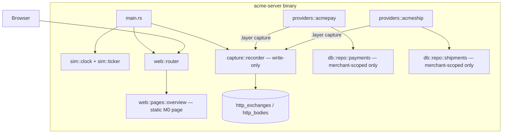
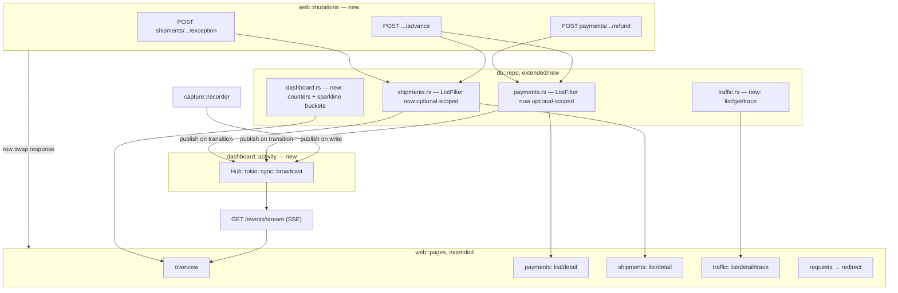
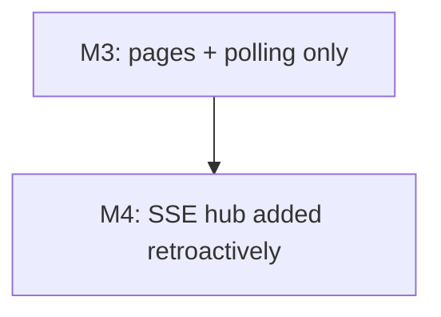

<!-- Instance of SPEC_TEMPLATE.md — see specs/SPEC_TEMPLATE.md -->

# Feature Spec: Dashboard (M3)

**Ticket Nº**: N/A — internal milestone, tracked as M3 in specs/000-Initial-Spec.md
§20, expanded by §21.14

## Objective

Implement milestone **M3 — Dashboard** from specs/000-Initial-Spec.md §20/§21.14:
mount a real dashboard on top of the tables M1/M2 already write for real —
Overview, Payments, Shipments, and the Traffic inspector (replacing the
plain "request log" page §20 originally scoped here, per §21.14's note
that the inspector "moves earlier, because it is the tool used to build
everything after it") — with list/detail pages, filters, an SSE live
feed, and advance/refund/exception actions.

Done when, per §20 and §13.1's three jobs ("show me what just happened",
"let me force the next thing to happen", "show me exactly what I sent and
what came back"): an engineer can debug a payment or shipment end to end —
find it, see its timeline, see the raw request/response that produced it,
and force it to its next legal state — without opening `acme.db` in a
SQLite client.

### Details

In scope:

1. **Design system** (spec §13.2/§13.5): rebuild `web::layout` to the
   six-token colour system, the IBM Plex Sans/Mono type scale (self-hosted
   woff2 subsets, no external font requests), the sandbox band, the
   200 px provider-organized left rail, and dense hairline-ruled tables
   with right-aligned tabular figures. The clock header is restyled to
   the seven-segment-style readout but stays **read-only** in this
   milestone — `POST /sim/clock` and the multiplier/pause/jump controls
   belong to the Simulator page (§13.6), which §20 assigns to M6.
2. **`htmx` + `htmx-ext-sse` vendored** into `static/` — neither is
   present yet (only `app.css` exists today); this milestone's first
   commit adds them alongside the font subsets.
3. **`domain::payment`/`domain::shipment`: `allowed_transitions()`**
   (spec §13.3's "buttons offered are computed from the state machine, so
   the UI can never offer an illegal transition"). Today only
   `can_transition_to(next) -> bool` exists; this milestone adds a public
   accessor enumerating the legal `(command, target status)` pairs from a
   given status, reusing the existing private transition table so the
   dashboard and the state machine can never disagree.
4. **`db::repo::payments`/`db::repo::shipments`: unscoped listing.**
   Both `ListFilter`s currently require a `merchant_id` and
   `provider_slug` (correct for the merchant-scoped provider APIs built in
   M2). The dashboard is unauthenticated and shows every merchant at once
   (spec §18), so both filters gain optional scoping plus the extra
   predicates §13.6/§21.8 ask for: status, provider, and a reference/
   tracking-number substring search.
5. **New `db::repo::traffic`**: the first *read* side of
   `http_exchanges`/`http_bodies`/`exchange_resources` — `capture::recorder`
   has been write-only since M1. Three queries: `list` (cursor-paginated,
   filterable per §21.8's applicable-now subset — direction, provider,
   method, status/status class, path substring, idempotent-replay-only —
   with `fault injected only` deferred, since fault injection doesn't
   exist before M6), `get` (one exchange with its headers/bodies joined),
   and `trace` (every exchange sharing a `trace_id`, ordered by
   `started_at`, for the waterfall view).
6. **New `db::repo::dashboard`**: aggregate counters and hourly sparkline
   buckets (payment/shipment counts by status, per-hour captured/delivered
   rate for the last 6h) feeding the Overview page's KPI row (spec
   §13.2's mockup).
7. **`web::pages`, one module per route**, each with a page handler and a
   sibling `*_rows`/`*_fragment` partial used by HTMX, both calling the
   same component functions (spec §13.5's "exactly one definition of a
   payment row"):
   - `GET /` — Overview: counters, sparklines, live activity feed.
   - `GET /payments`, `GET /payments/{id}` — list with filters; detail
     with timeline, side-by-side dialect-shaped vs. normalized JSON,
     related shipment, action bar.
   - `GET /shipments`, `GET /shipments/{id}` — list with filters; detail
     with tracking timeline, inline SVG route sketch, label preview,
     action bar. (The `veloz` moving-dot case in §13.6 doesn't apply yet —
     no `veloz` dialect exists before M5.)
   - `GET /traffic`, `GET /traffic/{id}`, `GET /traffic/traces/{trace_id}`
     — list, detail (summary/request/response/related panes; the
     signature pane is outbound-only and deferred to M4), trace waterfall.
   - `GET /requests`, `GET /requests/{id}` — aliases that redirect into
     `/traffic` with `direction=inbound`, per spec §13.3's own row.
8. **Mutation handlers**, HTMX row-swap pattern (§13.4 pattern 3):
   `POST /payments/{id}/advance`, `POST /payments/{id}/refund`,
   `POST /shipments/{id}/advance`, `POST /shipments/{id}/exception`.
9. **SSE live feed**: `GET /events/stream?channels=…`, backed by a new
   in-process broadcast hub (`dashboard::activity`) fed from two sources —
   `capture::recorder` (every captured exchange) and the payment/shipment
   repos' write paths (every state transition, including ticker-driven
   ones that never produce an inbound HTTP exchange to key off). Overview
   subscribes and applies out-of-band swaps to the header counters from
   the same push (§13.4 pattern 2). A `hx-trigger="every 3s"` polling
   fallback is wired behind a build-time feature flag, per the same
   section.
10. **Filter-forms pattern** (§13.4 pattern 1) on every list page: the
    form targets the table body and pushes its query into the URL so a
    filtered view is a shareable link.
11. **Progressive disclosure for traffic bodies** (§13.4 pattern 4):
    `hx-trigger="revealed"` plus a small server-side JSON tokenizer
    (spans, no client library) for the traffic detail's *pretty* body
    view — *raw* and *decoded* form-body rendering are part of this
    milestone too since they share the same pane; the webhook-specific
    `line_items[…]`/redirect-form decoding examples in §21.8 apply once
    those dialects exist (M5) but the decoder itself is generic.
12. **`app.js`** (~40 hand-written lines): clipboard-copy buttons for
    IDs/tracking numbers, the keyboard shortcuts (`/` focus search,
    `j`/`k` row navigation, `g p`/`g s` page jumps), and
    `prefers-reduced-motion` handling. "Copy as curl" (§21.10) is not
    part of this — it is bundled with the rest of §21.10's export tooling
    into M6 by §21.14.
13. **Architecture test extension** (spec §17's last row): the existing
    "no raw `sqlx::query` under `src/providers/`" test gains a sibling
    rule for `src/web/` — dashboard handlers go through `db::repo::*`
    like everything else, no exceptions for being unauthenticated.

Out of scope (explicitly scheduled for later milestones by §20/§21.14):
webhook pages (`/webhooks*`, health bars, the signature pane) and their
underlying dispatcher — M4; `/simulator` (clock controls, latency/failure
sliders, fault-rule table) and `/t/{provider}/{tracking}` public tracking
pages — M6; traffic's compare view, replay, HAR/NDJSON export, and
"copy as curl"/"copy as .http" — M6 per §21.14's own line item for that
milestone; `/providers` and `/providers/{slug}` (capability matrix,
status-mapping table) — deferred to M5, when eight more dialects exist and
a catalog page has more than two rows to justify itself; `/merchants`
(credential reveal) — not named in §20's M3 row; dark mode — M7's row
names it explicitly, so only the light palette ships now even though the
token structure in §13.2 makes adding the media query cheap later; the
"fault injected only" traffic filter — no fault engine exists before M6.

## Prior Art

specs/000-Initial-Spec.md §13 (the dashboard: design direction, routes,
HTMX patterns, Maud composition, page details, hosted checkout pages),
§18 (security posture — no dashboard auth), §20 (delivery plan), §21.8
through §21.14 (traffic inspector list/detail/trace views, the M3 line
item specifically). specs/002-Core.md for the state machines and event
log this milestone reads from without modifying. specs/003-First-Vertical-Slice.md
for `db::repo::payments`, `db::repo::shipments`, and the capture layer
already mounted on both provider routers — this is the first milestone
to give that captured data a reader.

## Tech Stack

| Crate/asset | Role in M3 | Status |
|---|---|---|
| `htmx.min.js`, `htmx-ext-sse.js` | Vendored static assets — all list/detail interactivity and the live feed | not present, added this milestone |
| IBM Plex Sans/Mono (woff2 subsets) | Self-hosted type per §13.2 | not present, added this milestone |
| `maud` | Page/fragment rendering | already in use (M0) |
| `axum` `sse` response type | `GET /events/stream` | needs confirming/enabling — not exercised by any route yet |
| `tokio::sync::broadcast` | `dashboard::activity::Hub` backing the SSE feed | `tokio` already pinned; `broadcast` is part of its default `sync` surface |
| `tower-http::services::ServeDir` | Serves the vendored JS/font assets alongside `app.css` | already in use (M0) |
| `sqlx` | `db::repo::traffic`, `db::repo::dashboard`, extended `ListFilter`s | already in use |
| `axum-test` | Dashboard page/fragment/SSE integration tests | already in use |
| `insta` | Snapshot the rendered Maud fragments (spec §17's Dashboard testing row) | already in use (M2), first use for HTML snapshots |

### Caveats

- `ListFilter::merchant_id`/`provider_slug` change from required to
  `Option<…>` on both `payments` and `shipments` repos. Every existing
  call site (the M2 provider handlers, which always have a real,
  auth-derived merchant) wraps its value in `Some(...)`; the SQL gains a
  conditional `AND merchant_id = ?` only when present. This is additive
  in behavior for M2's callers and is the only way to avoid a second,
  parallel query implementation for the dashboard's unscoped view.
- `db::repo::events::list` is merchant-*and*-provider-scoped by design
  (it backs the provider-facing `GET /events` endpoint) and is
  deliberately **not** reused as-is for the Overview/live-feed — those
  need a cross-merchant, cross-provider read that doesn't exist yet.
  `db::repo::dashboard` adds it rather than loosening `events::list`'s
  contract, since the provider API's scoping is a correctness property
  (a merchant must never see another merchant's events), not an
  incidental restriction.
- `capture::recorder` has never been read from. `db::repo::traffic` is
  new, not an extension — there is no prior query shape to preserve
  compatibility with.
- The dashboard has no auth (spec §18) by design; `db::repo::traffic`'s
  reads must still respect the existing redaction already applied at
  write time (`capture::redact`) — this milestone renders what's stored,
  it does not add new redaction logic.
- The clock header shows a value with nothing yet able to change it from
  the dashboard side (`SimClock`'s multiplier/pause live in `sim::clock`,
  driven only by config and the ticker until M6 adds `POST /sim/clock`).
  The Overview page's live feed still gives it a pulse — the readout
  updates as sim time advances via the ticker, observed the same way any
  other SSE-pushed value is — but the "instrument" interactivity described
  in §13.2 is genuinely incomplete until M6.

### Future Improvements

M4 adds the webhook pages this milestone doesn't build, plus the
signature pane on top of the traffic detail view this milestone does
build. M5 adds `/providers`/`/providers/{slug}` once there are enough
dialects to make a catalog worth navigating, and the `veloz` moving-dot
tracking sketch. M6 adds the Simulator page (finally making the clock
header interactive), traffic's compare/replay/export tooling, and public
tracking pages. M7 adds the dark-mode toggle, an on-screen keyboard-
shortcut cheat sheet, and empty-state curl snippets keyed to the real
seed data this milestone's Overview page currently has none of.

## Technical Details

### Current State

M2 shipped both reference dialects end to end, mounted `capture::layer`
on both routers, and gave `db::repo::payments`/`shipments` real rows to
query — but only in the merchant-scoped shape a provider API needs.
`http_exchanges`/`http_bodies` have been accumulating rows since M1 with
no reader. `web::pages` has exactly one page. There is no SSE, no vendored
HTMX, and no dashboard styling beyond `app.css`'s M0 placeholder.

## Proposal/s

### Option A: Build M3 exactly as §20/§21.14 scope it, extending existing repos plus one new `traffic` reader and one broadcast hub (chosen)

#### Introduction

Extend `db::repo::payments`/`shipments` for unscoped dashboard queries,
add `db::repo::traffic` and `db::repo::dashboard` as new readers over
already-written tables, add one `tokio::sync::broadcast`-backed activity
hub fed by both the recorder and the two resource repos, and build the
page/partial modules on top — mirroring the "extend what exists, add only
what's genuinely new" shape M2 used for `db::repo::payments` alongside
M1's `db::repo::shipments`.

#### Details

Request path for the live feed: any write to `payments`/`shipments`
(API-driven or ticker-driven) or any captured exchange publishes a small
`ActivityEvent` (kind, resource id, one-line summary, sim timestamp) onto
the hub; `/events/stream` subscribes a per-connection receiver and
re-renders each event as a ready-made Maud fragment server-side, matching
§13.4 pattern 2's "the server pushes ready-rendered Maud fragments, so
the browser does no templating."

Request path for an action button: `POST /payments/{id}/advance` with
`{to_status}` looks up `PaymentStatus::allowed_transitions()` for the
payment's current status, resolves the matching command (supplying a
dashboard-sourced default for commands that need extra data — see Open
Questions), calls the same `domain::payment::apply` the state-machine
tests already cover, writes through `db::repo::payments`, and returns the
single re-rendered `<tr>` — never a full-page reload.

#### Testing Strategy

| Layer | Approach |
|---|---|
| `allowed_transitions()` | Table test asserting it agrees with the existing exhaustive `(status, command)` table for both state machines — same fixture `domain::payment`/`shipment`'s own tests already build |
| `db::repo::payments`/`shipments` (extended `ListFilter`) | `#[sqlx::test]`: unscoped list returns rows across merchants; scoped list (existing M2 behavior) is unchanged byte-for-byte |
| `db::repo::traffic` | `#[sqlx::test]` seeding rows directly into `http_exchanges`/`http_bodies`: `list` respects each filter independently and combined; `get` joins bodies correctly; `trace` returns every exchange sharing a `trace_id` in `started_at` order |
| `db::repo::dashboard` | `#[sqlx::test]` asserting counters match a hand-seeded fixture; sparkline bucketing test with a fixed clock |
| `dashboard::activity::Hub` | Unit test: two subscribers both receive a published event; a lagging subscriber (channel full) doesn't panic the publisher (mirrors `capture::recorder`'s own drop-don't-block test) |
| Mutation handlers | `axum-test`: `POST .../advance` to an illegal target returns 4xx without writing a row; a legal target returns the swapped row fragment and the underlying row matches |
| Pages | `insta` snapshot of each page's rendered Markup against a fixed seeded fixture; a test asserting every route in §13.3's M3 subset returns 200; a test asserting no page issues an external network request (spec §17's Dashboard row) |
| SSE | `axum-test` opens `/events/stream`, triggers a mutation on a second connection, asserts the fragment arrives on the stream |
| Architecture | Extend the existing `src/providers/` raw-`sqlx`-query test to also cover `src/web/` |

#### Acceptance Criteria

| | |
|---|---|
| Given | A seeded database with payments and shipments in a mix of non-terminal and terminal statuses, and a running dashboard |
| When | An engineer opens `/payments/{id}` for a payment they just created via the API |
| Then | The page shows the timeline, the dialect-shaped response next to the normalized record, and an action bar containing exactly the transitions `PaymentStatus::allowed_transitions()` reports for its current status — no others |
| And | Clicking an action button re-renders only that row/header via HTMX, the new state is visible on `/payments` without a page reload, and the same transition appears within one second in the Overview live feed and in `/traffic` if it originated from an HTTP call |

#### Open Questions / Risks

##### Should `ListFilter` become optionally scoped, or should the dashboard get a parallel query path?

Extend the existing filter. A parallel path would duplicate the
column list, joins, and cursor-pagination logic already correct in
`db::repo::payments`/`shipments`, and would risk drifting from it the
next time either changes — exactly the failure mode the "repos are the
only code allowed to query" rule (spec §5, §17's architecture test)
exists to prevent. Making the merchant/provider scoping optional keeps
one implementation for both the authenticated provider API and the
unauthenticated dashboard.

##### What publishes to the activity hub — the recorder, the resource repos, or both?

Both. `capture::recorder` only sees HTTP-originated activity; a
ticker-driven shipment transition (no inbound request at all) would
never appear in the live feed if the hub only listened there. Conversely,
resource-repo writes alone would miss non-resource traffic like a 404 or
a validation failure that never reaches `domain::payment`/`shipment`.
Publishing from both, deduplicated by nothing more than "each is a
different kind of thing happening," matches the mockup in §13.2 which
mixes an HTTP line, a shipment transition, and a webhook line in the same
feed.

##### What does a dashboard-forced transition supply for commands that need extra data (`Reject(reason)`, `RefundPartially{amount}`, `Except`)?

`POST .../advance` takes only `{to_status}` per §13.3's mutation table.
For `Reject`, the dashboard supplies `DeclineReason::DoNotHonor` as a
generic default — the reason is cosmetic for a manually forced
transition. For `RefundPartially`/`Refund`, the dedicated
`POST /payments/{id}/refund` route (not the generic `/advance`) takes an
explicit amount, defaulting to the full remaining captured amount when
omitted; `/advance` itself does not offer refund targets for this reason,
even though they're reachable in the state machine. `Except` is likewise
its own route, `POST /shipments/{id}/exception`, precisely because it
needs a reason string with no sensible default — the generic `/advance`
route excludes any target whose command carries required data it can't
synthesize, and the dedicated routes cover those separately, matching
spec §13.3's own split between the generic and the two named mutations.

##### Is a clock-control-free Overview page still worth building now, or should `POST /sim/clock` move up from M6?

No move. §13.6 places "Clock controls" on the Simulator page by name and
§20's M6 row is the only place `/simulator` is scoped. M3's three jobs
(§13.1) are about *reading* what happened and forcing a *resource* to its
next state — none of them require adjusting simulated time, and pulling
clock control forward would blur M3's boundary for a control this
milestone's acceptance criteria don't need.

### Option B: Skip SSE for M3, poll every 3 seconds everywhere, defer the broadcast hub to whichever milestone needs it first (rejected)

#### Introduction

Build every list/detail page exactly as Option A does, but use only the
`hx-trigger="every 3s"` polling fallback from §13.4 as the *primary*
mechanism instead of building `dashboard::activity::Hub`, deferring SSE
itself to M4 (when webhook retry visibility makes it more obviously
worth the plumbing).

#### Details

#### Testing Strategy

Same page/repo tests as Option A; no SSE-specific tests since no SSE
endpoint would exist yet.

#### Acceptance Criteria

| | |
|---|---|
| Given | The same seeded scenario as Option A |
| When | A mutation happens on another connection |
| Then | The Overview feed reflects it only after its next 3-second poll, not within roughly one second |

#### Open Questions / Risks

##### Why was this rejected?

Because §20's own M3 row names "SSE live feed" as this milestone's
deliverable, not a future one, and because §13.4 documents SSE as the
*primary* pattern with polling only as a fallback "for clients without
SSE" — building the fallback first and the primary mechanism later
inverts that. It would also mean re-touching every page that consumes
the feed a second time once M4 arrives, for a savings that amounts to
one new module (`dashboard::activity`) built on a primitive
(`tokio::sync::broadcast`) already available with zero new dependencies.
