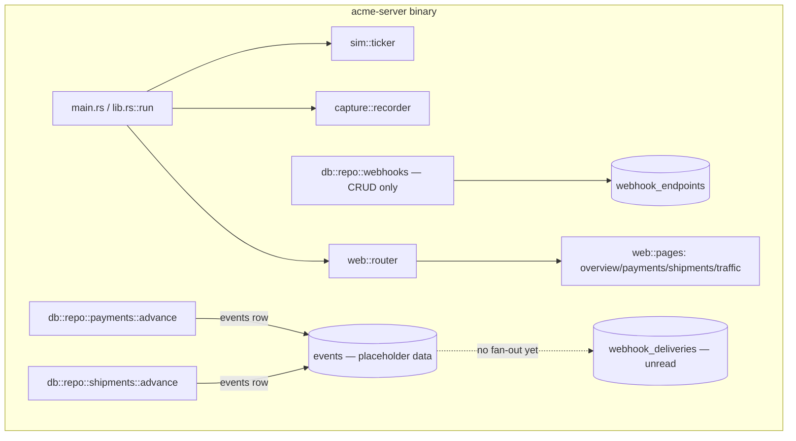
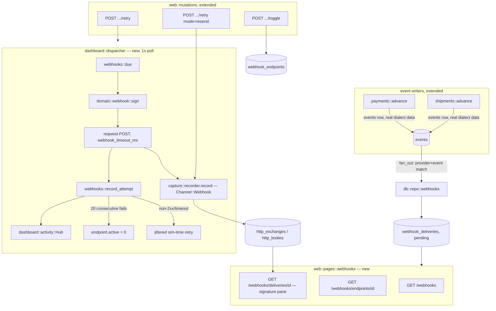
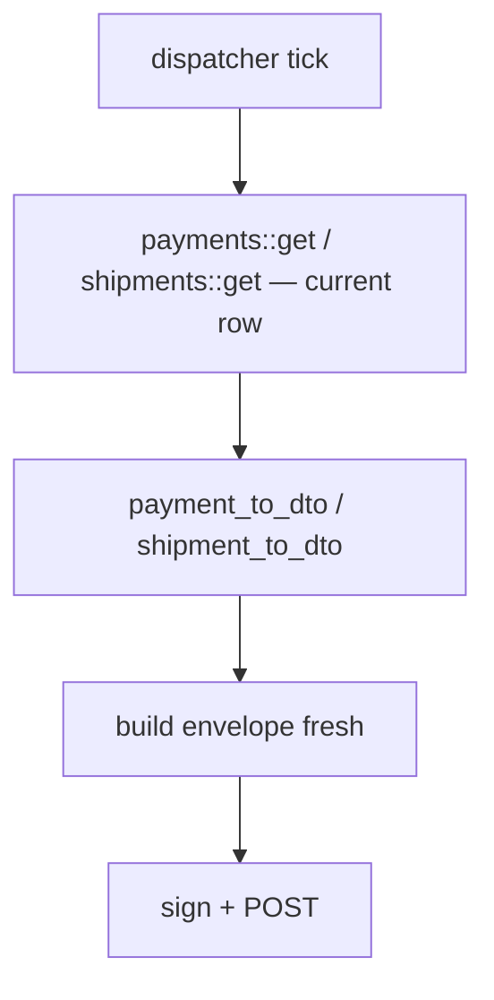

<!-- Instance of SPEC_TEMPLATE.md — see specs/SPEC_TEMPLATE.md -->

# Feature Spec: Webhooks (M4)

**Ticket Nº**: N/A — internal milestone, tracked as M4 in specs/000-Initial-Spec.md
§20, expanded by §21.14

## Objective

Implement milestone **M4 — Webhooks** from specs/000-Initial-Spec.md §12/§20/§21.14:
the outbound delivery pipeline (fan-out, signing, retries, auto-disable),
the three dashboard pages that make a delivery debuggable (`/webhooks`,
endpoint detail, delivery detail with the signature pane), and the two
webhook mutations — on top of `webhook_endpoints` CRUD, which M2 already
built.

Done when, per §20's own row: webhook tests are green, and a failing
endpoint visibly retries on the sim-time schedule and auto-disables after
20 consecutive failures — and, per §12.2, an engineer can copy the exact
signed string and a working verification snippet off the delivery detail
page and confirm a signature by hand.

### Details

In scope:

1. **`domain::webhook`: signing.** A `SigningScheme` keyed by
   `provider_slug`, matching §12.2's table. Only two dialects exist before
   M5 — Acme Pay and Acme Ship — and both use the same scheme (`Acme-Signature:
   t=…,v1=…` over `{t}.{raw_body}`, hex HMAC-SHA256), so this milestone
   implements exactly one variant behind a match that already has arms for
   the rest, so M5's seven remaining dialects (Chargeflow's
   `Chargeflow-Signature`, Pago Rápido's `x-signature`, Nordika's HTTP
   Signatures string, Iberex's raw-body HMAC, Postalis's HTTP Basic,
   ShipHub's query-token, Veloz's `X-Veloz-Signature`) each add one arm and
   one test, not a redesign.
2. **`domain::webhook`: event envelope.** A Stripe-shaped envelope —
   `{id, object: "event", type, created_at, livemode, data: {object: …}}`
   per §21.9's own example payload — wrapping the same `payment_to_dto`/
   `shipment_to_dto` output the provider APIs already return, so a
   merchant's webhook handler and their `GET /payments/{id}` response
   agree by construction.
3. **Fix `events.data`.** `db::repo::payments::append_event` and
   `db::repo::shipments`' equivalent currently write a placeholder
   (`{"status":"Captured"}`) instead of the dialect-shaped resource
   snapshot spec §7.5 documents (`data — JSON snapshot in dialect shape`).
   This milestone is the first consumer that needs the real snapshot — the
   webhook body *is* `events.data` at delivery time, not a value
   re-derived from the row's current state, so that "resend as originally
   signed" replays what actually happened even if the resource has since
   moved further. Both call sites are changed to serialize the same
   `payment_to_dto`/`shipment_to_dto` output used everywhere else,
   wrapped in the envelope from item 2. `GET /events`/`GET /events/{id}`
   (already shipped, M2) get real payloads as a side effect — today they
   return the same placeholder.
4. **`db::repo::webhooks`: fan-out and dispatch queries**, added to the
   existing CRUD-only module. `fan_out(event)`: on every event append,
   finds every active endpoint on the event's `provider_slug` whose
   `enabled_events` is `["*"]` or contains the canonical type, and inserts
   one `pending` `webhook_deliveries` row per match, `next_attempt_at =
   now`. `due(now, limit)`: pending/failed deliveries whose
   `next_attempt_at <= now`, one row per due *endpoint* (deliveries to the
   same endpoint are serialized per §12.1, so a second due delivery for an
   endpoint already `delivering` is skipped this pass). `record_attempt`:
   transitions a delivery's status, attempt count, `next_attempt_at`
   (jittered sim-time schedule), and `last_exchange_id`.
5. **`dashboard::dispatcher`**: a background task, spawned alongside the
   existing ticker in `lib.rs`, polling every 1 wall-clock second per
   §12.1. Each tick: pulls due deliveries, and for each — builds the
   envelope from `events.data`, signs it with the endpoint's
   `SigningScheme`, POSTs with a `webhook_timeout_ms`-bounded `reqwest`
   client (`Acme-Webhook-Id`/`Acme-Event-Id`/`Acme-Attempt`/`User-Agent`
   headers per §12.1), records the attempt as one outbound `Exchange`
   through the existing `capture::recorder` (`Channel::Webhook` — already
   defined, unused until now), and reschedules on non-2xx/timeout using
   the `0s → 30s → 2m → 10m → 1h → 6h` ±20% jittered schedule in **sim**
   time, converted through the existing `SimClock`. After
   `webhook_max_attempts` the delivery becomes `exhausted`. A stuck
   endpoint (mid-delivery, or past its own `next_attempt_at` but blocked)
   never blocks another endpoint's due deliveries in the same tick.
6. **Auto-disable.** After 20 consecutive failed/exhausted deliveries to
   one endpoint (tracked as a running counter on `webhook_endpoints`
   updated by `record_attempt`, reset to 0 on any `succeeded`), the
   endpoint's `active` flips to 0 and the fan-out step (item 4) stops
   creating new deliveries for it. This is config-independent of
   `webhook_max_attempts` — one delivery exhausting its own retries is not
   the same as 20 separate deliveries each failing outright.
7. **`web::pages::webhooks`**, mirroring the existing payments/shipments
   page-module shape (page handler + `*_rows`/`*_fragment` partial,
   spec §13.5):
   - `GET /webhooks` — endpoints list: URL, provider, health bar (24 sim
     hours of deliveries, success/failure), p95 response time, consecutive
     failure count, active/disabled state.
   - `GET /webhooks/endpoints/{id}` — endpoint detail: the same header
     plus a paginated delivery history table.
   - `GET /webhooks/deliveries/{id}` — delivery detail: the §21.9 signature
     pane (scheme, timestamp, secret with a `[reveal]` toggle, the exact
     signed string with a byte-count and copy button, the signature sent,
     the tolerance window), the attempt timeline with each response body,
     the endpoint's recent health, and the payload itself. Verification
     snippets (Node/Python/PHP/Rust) are rendered server-side, filled in
     with that delivery's real secret and payload, per §12.2's "turns the
     single most common integration failure into a copy-paste fix."
8. **Mutations**: `POST /webhooks/deliveries/{id}/retry` (a fresh attempt:
   new signature, new timestamp, same stored payload bytes — HTMX row
   swap) and a **Resend as originally signed** action on the same route
   (`{mode: "resend"}` in the form body) that replays the exact stored
   request bytes byte-for-byte, per §21.9's distinction between the two.
   `POST /webhooks/endpoints/{id}/toggle` (manual enable/disable,
   independent of the auto-disable counter, which it also resets on
   re-enable).
9. **Nav and layout**: `NavItem::Webhooks` added to `web::layout`'s rail
   enum, with a `/webhooks` link, next to the existing Traffic entry.
10. **Live feed**: delivery attempts publish to the same
    `dashboard::activity::Hub` M3 built (`ActivityEvent::resource("webhook",
    …)`), so a delivery shows up in the Overview feed the same tick it
    happens, matching §13.2's mockup mixing an HTTP line, a shipment
    transition, and a webhook line together.
11. **Architecture test extension**: `dashboard::dispatcher` goes through
    `db::repo::webhooks` like every other write path — the existing
    "no raw `sqlx::query` under non-repo modules" rule (spec §17) is
    checked against it the same way M3 checked it against `src/web/`.

Out of scope (per §20/§21.14, scoped to later milestones): six of the
seven remaining `SigningScheme` variants (`domain::webhook` gets the match
arms; the endpoints, dialects, and signing tests that exercise them ship
with each provider in M5, per that milestone's own "Definition of done
for a provider" item 5); the fault-rule engine, so `sim_faults` can't yet
target webhook delivery (`webhook_failure_rate` in `sim_settings` stays
unread until M6's chaos UI writes it); Compare view, HAR/NDJSON export,
and `Copy as curl`/`Copy as .http` on webhook exchanges specifically —
these are traffic-inspector-wide features M6 adds once (§21.10), not
duplicated per-milestone; `/providers`/`/providers/{slug}` capability
matrix — M5; dark mode — M7.

## Prior Art

specs/000-Initial-Spec.md §12 (delivery pipeline, signature schemes, event
catalog, endpoint health), §13.3/§13.6 (webhook routes, the signature
pane's exact layout), §21.9 (the payload viewer, byte-exact signed
string), §21.14 (the M4 traffic-inspector delta: outbound capture, the
signature pane, per-attempt history, resend-as-originally-signed).
specs/004-Dashboard.md for the page-module shape (`web::pages::*`, sibling
`*_rows` partials, the HTMX row-swap mutation pattern, `dashboard::activity`)
this milestone extends rather than reinvents. specs/002-Core.md,
specs/003-First-Vertical-Slice.md for the state machines, `capture::recorder`,
and `db::repo::payments`/`shipments::advance` this milestone's fan-out step
hooks into.

Already built, reused as-is: `db::repo::webhooks` (endpoint CRUD, M2),
`webhook_endpoints`/`webhook_deliveries` tables (already migrated, in
`20260101000002_core_schema.sql` and `20260101000003_traffic_schema.sql`),
`capture::recorder::Channel::Webhook` (defined, unused), `Config::webhooks_enabled`/
`webhook_timeout_ms`/`webhook_max_attempts` (already present, unread),
`payment_to_dto`/`shipment_to_dto` (M2, the dialect mapping this milestone's
envelope wraps), `dashboard::activity::Hub` (M3).

## Tech Stack

| Crate/asset | Role in M4 | Status |
|---|---|---|
| `hmac` | HMAC-SHA256 signing (`Acme-Signature`) | pinned in workspace `Cargo.toml`, not yet a dependency of `acme-server` — added this milestone |
| `reqwest` (`rustls-tls`, `json`) | Outbound HTTP client for delivery attempts | pinned in workspace, not yet a dependency of `acme-server` — added this milestone |
| `sha2`, `hex` | Already used by `capture::redact`'s hashing; reused for the HMAC digest and hex encoding | already in use |
| `tokio::time` | Dispatcher's 1-second poll loop, mirroring `sim::ticker`'s existing pattern | already in use (`sim::ticker`) |
| `maud` | Signature pane, endpoint/delivery pages | already in use |
| `sqlx` | `db::repo::webhooks` fan-out/dispatch queries | already in use |
| `axum-test` | Dispatcher and mutation integration tests, run against a mock HTTP server | already in use |
| `insta` | Snapshot the signature pane and verification snippets | already in use (M3) |

### Caveats

- `events.data`'s placeholder content (item 3) is a defect in M2/M3, not a
  new decision this milestone introduces — flagged here because M4 is the
  first thing that reads `events.data` for something a person acts on
  (a merchant's actual webhook body), so it can no longer be left as
  `{"status":"…"}` and be quietly harmless.
- Verification snippets are generated, not tested against a real
  Node/Python/PHP/Rust runtime in CI (no such toolchain in this Rust-only
  project). Snapshot tests fix the snippet text; a person still has to
  paste one into a REPL to actually verify it runs, per §12.2's own
  framing ("paste into a REPL and run") — this milestone builds the
  correct string, not a sandboxed executor for four languages.
- The dispatcher's 1-second poll is wall-clock (§12.1 says so explicitly)
  even though the retry *schedule* it computes is in sim time — the same
  split `sim::ticker` already has between its own wall-clock tick interval
  and the sim-time hops it produces.
- Postalis (HTTP Basic) and ShipHub (query-token) aren't really
  "signatures" at all — `SigningScheme` models them as scheme variants
  with no HMAC step, matching §12.2's table having `—` in their payload/
  encoding columns. Both are unreachable in M4 (no such providers yet) but
  the enum's shape is decided now so M5 doesn't need to restructure it.
- Auto-disable's 20-consecutive-failure counter lives on
  `webhook_endpoints` as a new column, not derived by re-scanning
  `webhook_deliveries` on every tick — the dispatcher already touches the
  endpoint row when recording an attempt, so maintaining a running counter
  there is one extra `UPDATE`, not a new query pattern.

### Future Improvements

M5 adds the other seven `SigningScheme` variants and the dialect-specific
event-name renaming inside each envelope's `type` field (§12.3 — the
canonical name stays what `enabled_events` filters on; only the outbound
`type` string changes per dialect). M6 adds `webhook_failure_rate`-driven
fault injection into the dispatcher and the Simulator page's chaos
controls. M6/M7 also add the traffic-inspector-wide export tooling
(§21.10) that will apply to webhook exchanges as a side effect of applying
to every exchange.

## Technical Details

### Current State

M2 built `webhook_endpoints` CRUD (register/get/delete) behind the
provider APIs and `webhook_deliveries`' table shape, but nothing ever
inserts a delivery row, nothing ever reads one, and `events.data` holds a
debug placeholder rather than the dialect snapshot the column is
documented to carry. M3 built the dashboard's page-module pattern,
`dashboard::activity::Hub`, and the HTMX mutation shape this milestone
reuses. `capture::recorder::Channel::Webhook` and three `Config` fields
(`webhooks_enabled`, `webhook_timeout_ms`, `webhook_max_attempts`) already
exist, sized for exactly this milestone, and are unread until now.

## Proposal/s

### Option A: Poll-based dispatcher over the existing schema, reusing `capture::recorder` for outbound capture (chosen)

#### Introduction

Add one background task (`dashboard::dispatcher`) that polls
`webhook_deliveries` every wall-clock second, the way `sim::ticker` already
polls due payments/shipments every wall-clock second — same primitive,
same crate, no new scheduling machinery. Every delivery attempt is
recorded through the *existing* `capture::recorder` as an outbound
`Exchange`, so `/traffic` gets webhook rows for free and the signature
pane just reads the same `http_exchanges`/`http_bodies` rows the traffic
inspector already knows how to render, joined through `webhook_deliveries.
last_exchange_id`.

#### Details

The signed-string pane's "exact bytes" requirement (§21.9) is what makes
`payload_body_id` on `webhook_deliveries` load-bearing rather than
incidental: the same body row is referenced by every attempt of a
delivery, so "Retry now" (fresh timestamp, fresh signature, same body) and
"Resend as originally signed" (identical bytes end to end, including the
original signature) are both just different choices about which of
`{timestamp, signature}` get recomputed — never the payload.

#### Testing Strategy

| Layer | Approach |
|---|---|
| `domain::webhook::sign` (Acme scheme) | Unit test against a hand-computed HMAC fixture — same shape as the "independent implementation" check spec §20's "Definition of done for a provider" item 5 already requires |
| `events.data` fix | `#[sqlx::test]` asserting a captured payment's `events` row deserializes to the same shape `payment_to_dto` produces for that row — regression-guards the placeholder from coming back |
| `db::repo::webhooks::fan_out` | `#[sqlx::test]`: `["*"]` matches everything; an explicit list matches only its members; a disabled endpoint gets no delivery; a different `provider_slug` gets no delivery |
| `db::repo::webhooks::due`/`record_attempt` | `#[sqlx::test]`: due respects `next_attempt_at`; two pending deliveries to the same endpoint yield only one due row; `record_attempt` advances the jittered schedule correctly across all 6 attempts and marks `exhausted` after the last |
| Auto-disable | `#[sqlx::test]`: 20 consecutive failures flips `active`; one intervening success resets the counter; 20 failures spread across two different endpoints disables neither |
| `dashboard::dispatcher` | `axum-test`-style test spinning up a local mock HTTP server (success, 500, timeout cases); asserts a captured `Exchange` lands in `http_exchanges` with `Channel::Webhook`, and the delivery's status/attempt/`next_attempt_at` update correctly |
| Mutation handlers | `axum-test`: retry re-signs with a new timestamp; resend reproduces byte-identical request bytes against the mock server; toggle flips `active` and stops future fan-out |
| Pages | `insta` snapshot of the signature pane against a fixed fixture (secret, payload, and signature all deterministic); a test asserting the four verification snippets each contain the same signed-string bytes as the pane |
| Architecture | Extend the existing raw-`sqlx::query`-outside-repos test to cover `dashboard::dispatcher` |

#### Acceptance Criteria

| | |
|---|---|
| Given | A registered Acme Pay webhook endpoint pointed at a server that returns `500` for every request, and a payment that transitions to `captured` |
| When | The dispatcher's next tick runs |
| Then | A `webhook_deliveries` row exists in `failed` status with `attempt = 1` and `next_attempt_at` roughly 30 sim-seconds out (±20% jitter), and `/webhooks/deliveries/{id}` shows the exact signed string, the response the endpoint returned, and a working verification snippet in all four languages |
| And | After 20 such consecutive failures on that endpoint, `/webhooks` shows it disabled with the reason, further transitions produce no new delivery for it, and re-enabling it via `POST /webhooks/endpoints/{id}/toggle` resets the counter |

#### Open Questions / Risks

##### Should `events.data`'s placeholder be fixed as part of this milestone, or is that a separate bugfix?

Fixed here. M4 is the first caller that turns `events.data` into
something a real HTTP request carries to an external server — leaving the
placeholder in would mean shipping webhooks that deliver
`{"status":"Captured"}` instead of a payment, which fails this milestone's
own acceptance criteria, not some other one. Deferring it would also mean
touching `payments::advance`/`shipments::advance` again in a later
milestone for a fix this milestone already needs to make correctly.

##### Where does `webhook_deliveries.trace_id` come from for a ticker-driven transition, since `events` itself has no `trace_id` column?

Captured at fan-out time, not stored on `events`. `capture::trace::current_trace_id()`
is `Some` when fan-out runs inside an inbound request's scope (API-driven
or, once mounted, dashboard-driven transitions) and `None` for the ticker.
`fan_out` uses the current trace id when present, and mints a fresh
`TraceId::new()` otherwise — the same thing `capture::trace` already
documents as its behavior "outside a `scope`." This gives every delivery
of a given event one shared `trace_id` across all its attempts (so the
trace waterfall groups them, per §21.4), without requiring a schema change
to `events`.

##### Does `enabled_events` matching use the canonical name or the dialect-renamed one?

Canonical. `CreateWebhookEndpointRequest::enabled_events`'s own doc
comment already says `e.g. ["payment.captured"]`, and §12.3 states this
directly: "The canonical name is what the dashboard filters on." Dialect
renaming (`shipment.delivered` → `SEGUIMIENTO_ENTREGADO` for Iberex) is
purely an outbound-payload concern, applied only inside the envelope's
`type` field at send time — it never touches matching, filtering, or the
`enabled_events` column's contents.

##### Why serialize the envelope from `events.data` instead of re-running `payment_to_dto`/`shipment_to_dto` against the row at send time?

Because "Resend as originally signed" (§21.9) has to reproduce the
*original* bytes, and a resource's row can keep changing after the event
that described one moment of it — a payment can be refunded, disputed,
and charged back, each producing its own event, while an earlier delivery
for `payment.captured` is still retrying. Re-deriving from the current row
at attempt time would make attempt 4 of a `captured` delivery describe a
`charged_back` payment, which is simply wrong. `events.data` is captured
once, at the moment the event happened, precisely so every attempt (and
every resend) of that delivery keeps describing that moment.

### Option B: Re-derive the payload from the live resource row at send time, skip storing it on `events` (rejected)

#### Introduction

Instead of fixing `events.data`, add a dispatcher that calls
`payment_to_dto`/`shipment_to_dto` fresh against the resource's *current*
row every time a delivery attempt fires, building the envelope on the fly
and never touching the `events` table's stored content.

#### Details

#### Testing Strategy

Same dispatcher/signing tests as Option A, plus a test asserting that a
delivery attempt fired after the resource changed status again reflects
the *new* status — which is the behavior Option A's testing strategy
explicitly asserts against.

#### Acceptance Criteria

| | |
|---|---|
| Given | A `payment.captured` delivery still retrying, and the same payment later refunded |
| When | The delivery's next attempt fires |
| Then | The webhook body describes the payment as `partially_refunded`/`refunded`, not `captured` — contradicting the `payment.captured` event type in the same envelope |

#### Open Questions / Risks

##### Why was this rejected?

Because the acceptance criteria above is itself the bug: a `payment.captured`
event whose body says `refunded` is a broken webhook, and "Resend as
originally signed" (§21.9, explicitly scoped to M4 by §21.14) becomes
impossible to implement correctly — there would be no "original" to
resend, only whatever the row currently says. It also leaves
`events.data` a decorative placeholder forever, when `GET /events`
(already shipping, M2) is documented to return a real dialect snapshot and
currently doesn't.
