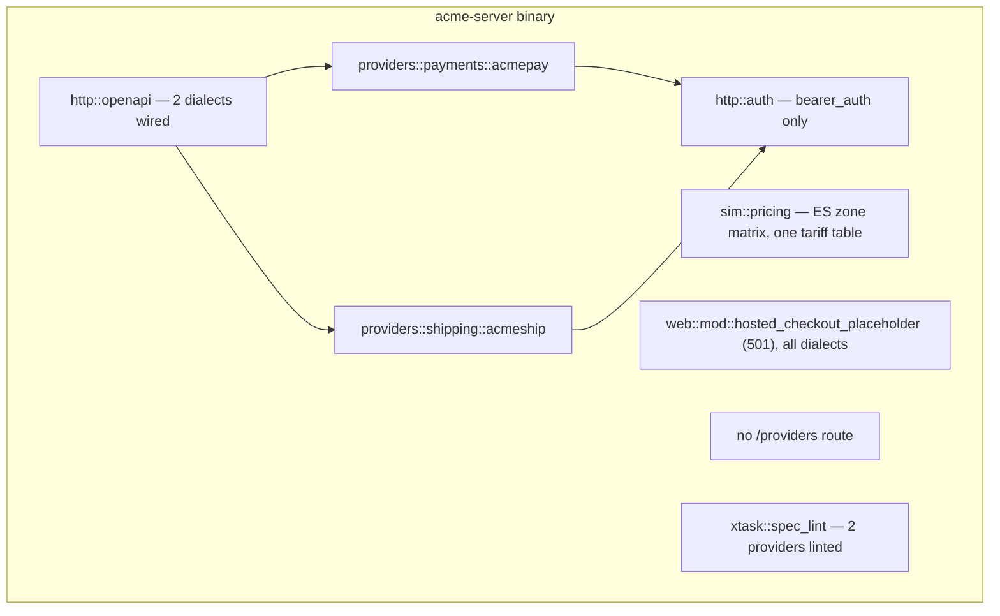
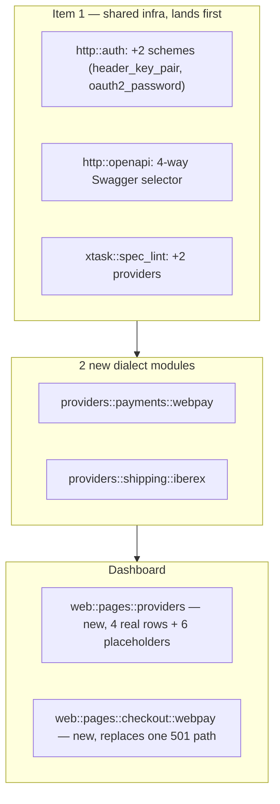
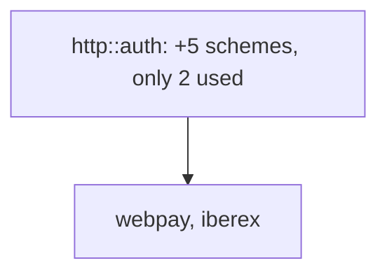

<!-- Instance of SPEC_TEMPLATE.md — see specs/SPEC_TEMPLATE.md -->

# Feature Spec: Dialects — First Slice (M5a)

**Ticket Nº**: N/A — internal milestone, tracked as M5 in specs/000-Initial-Spec.md
§20, narrowed to a first slice by this spec (see Objective)

## Objective

Implement a **first, testable slice** of milestone **M5 — Dialects** from
specs/000-Initial-Spec.md §20: exactly **one** new payment dialect
(**Trancorp Webpay**, §10.2) and exactly **one** new shipping dialect
(**Iberex Express**, §11.2), rather than all eight dialects §20 lists at
once.

§20's own M5 row is a single 4-day estimate for eight dialects plus
hosted checkout pages plus per-provider specs — too large a unit to
implement and verify in one pass with the same rigor M2/M4's milestones
got. This spec proves the per-dialect module pattern, the auth-middleware
extension points, and the OpenAPI/spec-lint registration path end to end
on two deliberately simple, low-coupling dialects, so the remaining six
(notes for which now live in specs/007-Additional-Dialects.md) are a
mechanical repetition of an already-working pattern rather than a
simultaneous first attempt at eight.

Trancorp and Iberex were chosen as the first two because they are each the
_simplest_ dialect in their category that still exercises a genuinely new
auth scheme (§20's own "Definition of done" item 2's "including the
awkward parts"): Trancorp has no webhooks at all, so it needs zero new
`domain::webhook::SigningScheme` work; Iberex reuses `sim::pricing`'s
existing ES zone matrix as-is, so it needs zero new pricing work. Between
them they still add two of the product's four still-missing auth kinds
(header key-pair, OAuth2 password grant) and prove `/providers` is worth
building with more than two rows.

Done when, per §20's "Definition of done for a provider", all eight items
are true for **both** Trancorp and Iberex, each has a passing `insta`
snapshot integration test, both appear in Swagger, and `/webpay/checkout`
(§13.7) replaces M2's `501` placeholder end to end.

### Details

In scope:

1. **Shared infrastructure**, the minimum this slice's two dialects
   actually need (not the full five-scheme, six-signing-variant set
   specs/007-Additional-Dialects.md still needs — see that spec's own
   Prior Art for why the rest waits):
   - `http::auth` grows two new schemes alongside the existing
     `bearer_auth`: `header_key_pair` (Trancorp: static
     `Tbk-Api-Key-Id`/`Tbk-Api-Key-Secret` headers, no expiry, checked
     against `api_credentials` the same way `bearer_auth` checks a
     bearer token — just a different header pair) and `oauth2_password`
     (Iberex: `POST /services/oauth2/token` with
     `grant_type=password`/`username`/`password`/`client_id`/
     `client_secret`, issuing a short-lived bearer token that the
     _existing_ `bearer_auth` middleware then validates unchanged once
     issued — the new part is only the token-issuing handler, not a new
     validation primitive).
   - `domain::webhook::SigningScheme` is **not** touched by this slice:
     Trancorp has no webhooks (§10.2's own line) and shipping dialects
     don't expose `POST /webhook_endpoints` at all — `acmeship` doesn't
     today, and Iberex follows that precedent, matching §11.1's route
     table having no `webhook_endpoints` row.
   - `http::openapi`'s `SecurityAddon` gains the two new security schemes;
     its combined-spec merge and `SwaggerUi::urls(...)` list grow from
     two entries to four.
   - `xtask::spec_lint::run()` grows one `lint_provider`/
     `lint_source_operation_ids` pair for `webpay` and one for `iberex`.
   - `requests/webpay.http` and `requests/iberex.http` (§20's
     "Definition of done" item 8).
2. **Trancorp Webpay** (§10.2), `src/providers/payments/webpay/` —
   `dto.rs`/`map.rs`/`routes.rs`/`mod.rs` mirroring `acmepay`'s shape
   exactly (spec §10.1 is the structural template, per
   specs/003-First-Vertical-Slice.md): the create→commit two-step flow
   with a `token`/`url` redirect in between (POST create returns
   `{token, url}`; the shopper is redirected to `url`, which is this
   slice's hosted checkout page; the merchant then `PUT`s the token to
   commit), `response_code` integer (`0` = approved, with the documented
   negative codes for each decline reason), `422 {"error_message": …}`
   on committing an already-locked or expired token (tokens expire after
   5 sim minutes), header key-pair auth, no webhooks. Reuses
   `domain::payment`'s state machine and `domain::scenario`'s magic
   values completely unchanged (§9.1) — only the dialect-facing shape and
   the two-step choreography are new code.
3. **Iberex Express** (§11.2), `src/providers/shipping/iberex/` — same
   module shape under `src/providers/shipping/`: OAuth2 password grant,
   Spanish field names (`ccc`, `bultos`, `expediciones`,
   `clienteExpedidor`/`clienteDestinatario`), `dd/MM/yyyy HH:mm` dates,
   decimal kilograms and euros, inline base64/raw-ZPL labels,
   `resultado: "OK"|"KO"` carrying the real outcome under an always-`200`
   HTTP status. Adds one `sim::pricing` tariff table
   (`base_cents`/`included_kg`/`per_step_cents`/`services`) reusing the
   **existing** ES zone matrix unchanged — no new pricing code beyond
   that table. Rating, label creation, tracking, and cancel all call the
   same `sim::pricing::quote`/`domain::shipment::apply`/
   `happy_path_schedule` machinery `acmeship` already exercises; only
   `map.rs` translates between Iberex's field names/status codes
   (`PENDIENTE_RECOGIDA`, `RECOGIDO`, `EN_TRANSITO`, …, per §11.6's own
   row) and the normalized ones.
4. **`/webpay/checkout?token_ws=…`** (spec §13.7), the _only_ hosted
   checkout page this slice needs (Chargeflow/Acme's shared checkout
   component, Pago Rápido's method chooser, and Nordika's SCA challenge
   all wait for their own dialects in specs/007-Additional-Dialects.md):
   a card form with forced approve/reject/abandon buttons, redirecting
   the browser back to the merchant's `return_url` as a form `POST`
   carrying `token_ws`, replacing `web::mod::hosted_checkout_placeholder`
   (M2's `501` stub) for the Webpay path specifically — the stub stays in
   place for every other dialect's checkout URL until specs/007 lands
   them. Carries the persistent _"Simulated checkout — do not enter real
   card details"_ banner and only accepts the published test PANs,
   styled deliberately unlike the dashboard.
5. **`/providers` and `/providers/{slug}`** (spec §13.3, deferred from M3
   by specs/004-Dashboard.md, deferred again from the original M5 draft):
   with four providers now registered (`acmepay`, `acmeship`, `webpay`,
   `iberex`) this is worth building — a catalog table from a `const`
   capability array each provider module now defines (the columns §10.6/
   §11.6 will eventually fill out fully; this slice's table has real data
   for its four rows and `—` for the six not yet built, which is itself
   useful — a visible checklist of what specs/007 still owes).
   `/providers/{slug}` adds sample calls from that dialect's
   `requests/{slug}.http` and its seeded credential from
   `api_credentials`.
6. **Magic-value and pricing reuse, not reinvention**: `domain::scenario`'s
   PAN-based matching (§9.1) is already provider-agnostic — Webpay's
   `map.rs` calls the same scenario resolution `acmepay` does. Iberex's
   rating handler calls the same `sim::pricing::quote` `acmeship` does.
   Neither dialect gets its own copy of either table.

Out of scope (moved to specs/007-Additional-Dialects.md, not dropped):
Pago Rápido, Chargeflow, Nordika Pay, Postalis, ShipHub, Veloz, their five
still-missing auth schemes and six still-missing `SigningScheme` variants,
`serde_qs` bracket-notation parsing (Chargeflow-only), the `veloz`
moving-dot sketch, Nordika's payment↔shipment coupling, and three of the
four hosted checkout pages. Also unchanged from the original M5 draft's
own out-of-scope list: the fault-rule engine and Simulator page (M6),
public tracking pages (M6), CL/BR/international `sim::pricing` zone
matrices (no dialect in this slice or in specs/007 is CL/BR-based),
traffic-inspector changes (§21.14's delta table has no M5 row).

## Prior Art

specs/000-Initial-Spec.md §9 (magic values, reused verbatim), §10.1/§11.1
(Acme Pay/Ship — the structural template both dialects below copy), §10.2
(Trancorp), §11.2 (Iberex), §11.6 (status mapping table, the two new rows
this slice adds real data to), §13.3/§13.7 (`/providers`, Webpay's hosted
page), §14 (OpenAPI/Swagger multi-spec assembly). specs/002-Core.md for
the state machines both dialects' `map.rs` target without modifying.
specs/003-First-Vertical-Slice.md for the exact `dto.rs`/`map.rs`/
`routes.rs`/`mod.rs` module shape, the capture→auth→idempotency
middleware stack order, and `cargo xtask spec-lint`, reused as-is.
specs/004-Dashboard.md for `/providers` being named-and-deferred here.
specs/005-Webhooks.md for confirming shipping dialects (and so Iberex)
never touch `domain::webhook::SigningScheme`. specs/007-Additional-Dialects.md
for the six dialects, five auth schemes, and six signing-scheme variants
this spec deliberately does not build yet.

## Tech Stack

| Crate/asset                     | Role in this slice                                                                                                                                                                                                                  | Status         |
| ------------------------------- | ----------------------------------------------------------------------------------------------------------------------------------------------------------------------------------------------------------------------------------- | -------------- |
| `hmac`, `sha2`, `hex`, `base64` | Already in use (M4); `header_key_pair` needs none of them (static header comparison, no signing) — listed only because `oauth2_password`'s issued-token comparison reuses the same constant-time patterns `bearer_auth` already has | already in use |
| `serde_json`/`utoipa`           | Two more `#[derive(OpenApi)]` structs, growing the total from 2 to 4                                                                                                                                                                | already in use |
| `insta`                         | One snapshot integration test per dialect                                                                                                                                                                                           | already in use |
| `axum-test`                     | Integration tests, including the OAuth2 token exchange and the Webpay redirect-and-commit dance                                                                                                                                     | already in use |

No new external dependency — everything this slice needs is already
pinned.

### Caveats

- `header_key_pair` has no expiry and no refresh, matching Trancorp's own
  real-world integration credentials (§10.2's worked example headers are
  static). This is a real, if minor, divergence from `oauth2_password`'s
  short-lived-token model sitting right next to it in the same file — the
  two schemes are intentionally not unified behind one abstraction,
  because forcing Trancorp's static pair through an "expiring token"
  shape (or vice versa) would be modeling a expiry policy neither
  dialect actually has.
- Iberex's tariff table reusing the ES zone matrix means an Iberex quote
  and an Acme Ship quote for the same parcel can differ only in the
  tariff numbers (`base_cents`/`per_step_cents`/services), never in which
  zone a postal-code pair resolves to — that resolution function is
  shared, not duplicated.
- `/providers`' capability table will show six dialects' rows as mostly
  `—` until specs/007 lands them. This is deliberate (see item 5) rather
  than a page half-built by accident — the alternative was not shipping
  `/providers` at all until all ten providers exist, which delays a
  useful page for no correctness reason.

### Future Improvements

specs/007-Additional-Dialects.md is the direct continuation: Pago Rápido,
Chargeflow, Nordika, Postalis, ShipHub, Veloz, in whatever order their own
dependencies allow (ShipHub last, since it fans out into Iberex/Postalis/
Veloz's own pricing). Once Veloz exists, the moving-dot sketch
(specs/004-Dashboard.md §13.6) becomes buildable. Once Nordika exists,
the payment↔shipment coupling becomes buildable. M6 adds the fault-rule
engine, Simulator page, and public tracking pages, per §20's own plan,
unaffected by this slice's narrower scope.

## Technical Details

### Current State

M2 built both reference dialects end to end, including the module shape,
the capture→auth→idempotency middleware stack, and `cargo xtask
spec-lint`. M4 built `domain::webhook`'s signing/envelope machinery,
untouched by this slice since neither Trancorp nor Iberex has webhooks.
`sim::pricing` has one tariff table (Acme Ship's own) over the ES zone
matrix; Iberex adds a second table over the same matrix, no new matrix
code.

## Proposal/s

### Option A: Exactly two new dialect modules plus their two auth schemes, nothing else (chosen)

#### Introduction

Build `webpay` and `iberex` as two independent modules copying
`acmepay`'s/`acmeship`'s shape exactly, add only the two auth schemes
each one specifically needs, and stop there — no speculative work on the
other six dialects' auth/signing needs, even though some of that work
(e.g. `oauth2_client_credentials` for Nordika) is a small delta from what
this slice already builds. Building only what two concrete dialects need
keeps this slice reviewable and testable as one unit, and
specs/007-Additional-Dialects.md is exactly the place that speculative
groundwork belongs once a second dialect actually needs it.

#### Details

#### Testing Strategy

| Layer                             | Approach                                                                                                                                                                                                         |
| --------------------------------- | ---------------------------------------------------------------------------------------------------------------------------------------------------------------------------------------------------------------- |
| `header_key_pair`                 | `axum-test`: valid key pair succeeds, wrong/missing secret 401s                                                                                                                                                  |
| `oauth2_password`                 | `axum-test`: valid credentials issue a token that then authenticates a real protected call; wrong credentials 401 the token exchange itself                                                                      |
| Webpay `map.rs`                   | Table test: every §9.1 payment magic value produces the documented `response_code`/status, reusing `domain::scenario`'s existing fixtures                                                                        |
| Iberex `map.rs`                   | Table test: every §9.2 shipping magic value produces the documented outcome; a status-mapping test asserting every `domain::shipment::ShipmentStatus` round-trips through Iberex's Spanish status codes and back |
| Both dialects                     | One `insta` snapshot integration test each: create, retrieve, list, the failure path, and the terminal state (§20 item 7)                                                                                        |
| Webpay two-step flow              | `axum-test`: create returns `{token, url}`; commit before visiting `url` still succeeds (commit doesn't require the redirect); committing twice is `422`; committing after 5 sim minutes is `422`                |
| `/webpay/checkout`                | `axum-test`: page 200s for a valid token, the approve/reject/abandon buttons each drive the underlying transaction to the right pre-commit state, and the redirect back to `return_url` carries `token_ws`       |
| `/providers`, `/providers/{slug}` | `insta` snapshot with all four real rows; a test asserting the six not-yet-built dialects render as explicit placeholders, not silently omitted rows                                                             |
| Architecture/spec-lint            | `cargo xtask spec-lint` passes for all four providers                                                                                                                                                            |

#### Acceptance Criteria

|       |                                                                                                                                                                                                                                                                                                                                       |
| ----- | ------------------------------------------------------------------------------------------------------------------------------------------------------------------------------------------------------------------------------------------------------------------------------------------------------------------------------------- |
| Given | A fresh seeded database and a running dashboard                                                                                                                                                                                                                                                                                       |
| When  | An engineer opens `/providers`                                                                                                                                                                                                                                                                                                        |
| Then  | `acmepay`, `acmeship`, `webpay`, and `iberex` are listed with real capability data; the other six rows are visibly placeholders, not missing                                                                                                                                                                                          |
| And   | A Trancorp Webpay payment can be created, redirected through `/webpay/checkout`, committed, and reaches `captured`/`rejected` per the chosen test card; an Iberex shipment can be rated, created, tracked through its Spanish status codes, and cancelled — both independently, with passing `insta` snapshots and Swagger visibility |

#### Open Questions / Risks

##### Why Trancorp and Iberex specifically, and not e.g. Pago Rápido and Postalis?

Lowest coupling. Trancorp needs no webhook work at all (§10.2 has none);
Iberex needs no new pricing work (reuses the ES matrix as-is). Pago
Rápido would immediately require a new `SigningScheme` variant _and_ two
fake payer pages (PIX, boleto); Postalis's two-phase pre-registration
flow is a real second choreography to design, similar in kind to Webpay's
own two-step but not identical, which would make this slice's "prove the
pattern" goal harder to isolate from "also invent a second choreography."
Trancorp and Iberex each add exactly one genuinely new thing (an auth
scheme) on top of the already-proven module shape.

##### Should `/providers` wait until all ten dialects exist, per the original M5 draft's plan?

No. specs/004-Dashboard.md deferred it specifically for having "more than
two rows to justify itself" — four rows already clears that bar, and
shipping the page now with six visible placeholder rows turns it into a
running checklist for specs/007-Additional-Dialects.md's own work, which
is more useful than a page that appears all at once at the end.

### Option B: Land all four new auth schemes and the Trancorp/Iberex modules together, to save a second infra pass later (rejected)

#### Introduction

Since `oauth2_client_credentials` (Nordika), `http_basic` (Chargeflow/
Postalis), and `hmac_request` (Veloz) are each a small delta from
`oauth2_password`/`header_key_pair`, build all five auth schemes now,
even though only two are used by this slice's own dialects.

#### Details

#### Testing Strategy

The same two dialects' tests as Option A, plus tests for three auth
schemes with no caller anywhere in the codebase to exercise them
end-to-end — only unit-level, never integration-level, until
specs/007-Additional-Dialects.md adds a real dialect that uses each one.

#### Acceptance Criteria

|       |                                                                                                                                                                                                                                                                   |
| ----- | ----------------------------------------------------------------------------------------------------------------------------------------------------------------------------------------------------------------------------------------------------------------- |
| Given | This slice's PR, reviewed on its own                                                                                                                                                                                                                              |
| When  | A reviewer asks why `http_basic` exists when no route in the diff uses it                                                                                                                                                                                         |
| Then  | The answer is "a future dialect will," which is exactly the kind of speculative-generality justification the project's own conventions (specs/003-First-Vertical-Slice.md, specs/004-Dashboard.md's own "extend only what's genuinely new" pattern) argue against |

#### Open Questions / Risks

##### Why was this rejected?

Because untested-by-any-real-caller code is the thing this project's own
prior specs have consistently avoided — `domain::webhook::SigningScheme`
shipped in M4 with exactly one variant for exactly the reason this
option would violate (specs/005-Webhooks.md's own "one variant on
purpose" framing). Three auth schemes with no route to authenticate would
be exercised only by unit tests written against an imagined caller, which
is worse than writing them in specs/007 next to the dialect that actually
calls each one — same total work, but never speculative.
