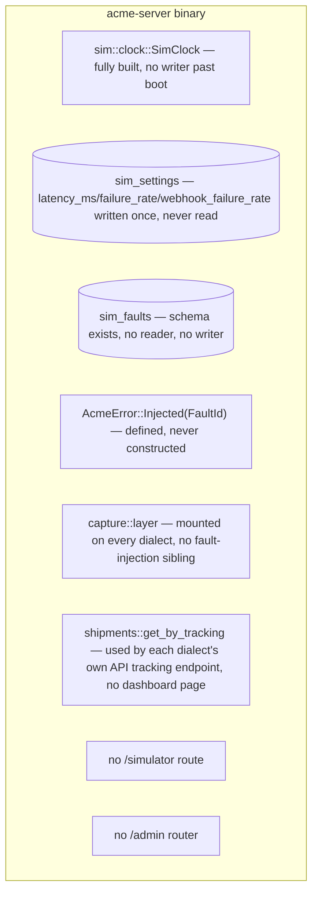
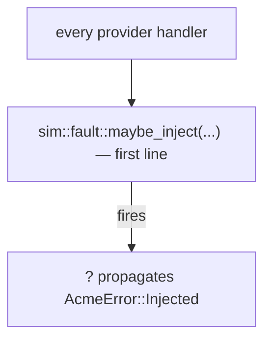

<!-- Instance of SPEC_TEMPLATE.md — see specs/SPEC_TEMPLATE.md -->

# Feature Spec: Simulation (M6)

**Ticket Nº**: N/A — internal milestone, tracked as M6 in specs/000-Initial-Spec.md
§20, expanded by §21.14

## Objective

Implement milestone **M6 — Simulation** from specs/000-Initial-Spec.md §20:
the fault-rule engine, the global latency/failure sliders, the Simulator
page that exposes both (finally making the clock header interactive,
per specs/004-Dashboard.md's own deferral), public tracking pages, and
— per §21.14's own M6 row — the traffic inspector's Compare view, Replay,
HAR/NDJSON export, and capture-mode controls.

Done when, per §20's own row: "a demo can produce a 503, a decline, and a
lost parcel on request" — a fault rule can make any provider endpoint fail
on command, a magic value can still force a decline (already true since
M2), and `NADIE`/`PERDIDO` can already force a lost parcel (also already
true since M2) — so this milestone's real bar is the _503_: nothing
before it can inject an infrastructure-level failure into a live request.

### Details

In scope:

1. **`sim::fault`: the fault-rule engine.** A new middleware,
   `sim::fault::inject`, mounted in every provider dialect's `build()`
   between `capture::layer` (outermost, so an injected failure is still
   captured and visible in `/traffic`) and auth (a fault fires before
   credentials are even checked, matching a real edge outage's
   indifference to who's asking): on each request, matches
   `sim_faults` rows by `provider_slug` (`NULL` = all), `method` (`NULL`
   = all), and `path_glob` against the request path, filtered to
   `active = 1` and (if set) `expires_at` in the future, then rolls
   `probability`; a match applies its `mode`:
   - `error` — short-circuits with `http_status`/`error_code`, rendered
     through `AcmeError::Injected(FaultId)` (already scaffolded — spec
     §8.5's error enum has carried this variant, mapped to `503`, since
     before this milestone existed to use it).
   - `latency` — `tokio::time::sleep(latency_ms)` before calling `next`.
   - `timeout` — holds the connection past `config.request_timeout`
     (a new, small config field) then drops it, rather than ever
     responding.
   - `malformed` — lets the real handler run, then truncates its JSON
     response body mid-stream.
   - `rate_limit` — `429` with `Retry-After` and the matched dialect's
     own rate-limit header shape (a small per-dialect header-name table,
     mirroring `domain::webhook::SigningScheme`'s one-table-per-dialect
     shape).
     A firing rule with `remaining` set decrements it (via
     `db::repo::faults`) and deactivates itself at zero.
2. **Global latency/failure**, the same middleware's baseline layer below
   any matched rule: every request sleeps `sim_settings.latency_ms` and,
   independently, has a `sim_settings.failure_rate` chance of a generic
   `503` — these two `Config`/`sim_settings` fields have existed since M1
   (`db::bootstrap_sim_clock` already writes them) with no reader until
   now. `webhook_failure_rate` is `dashboard::dispatcher`'s own
   equivalent roll, applied right before a delivery attempt's real
   `reqwest` call.
3. **`db::repo::faults`**: CRUD over `sim_faults`
   (`create`/`list`/`delete`/`decrement_remaining`), and
   **`db::repo::sim`**: read/write `sim_settings`
   (`get`/`set_clock`/`set_latency_and_failure`) — the clock-persistence
   half of this was already promised by `db::bootstrap_sim_clock`'s own
   doc comment ("a restart never resets a dashboard-adjusted clock") but
   never had a writer, since nothing before this milestone changed the
   clock after boot.
4. **`POST/GET/DELETE /admin/faults`**, a new `admin` router (spec §9.3,
   §21.11) mounted alongside the dialect routers, documented in its own
   Swagger tab — the dashboard's fault-rule form is a thin client of this
   same API, not a separate code path.
5. **`POST /sim/clock`** (`{multiplier|pause|jump_seconds}`, spec §13.3):
   wires the dashboard's clock header — read-only since M3 by design — to
   `SimClock::set_multiplier`/`jump`, both of which have been fully
   implemented and unit-tested since M1 with no caller. Pausing calls
   `set_multiplier(0.0)` but leaves `sim_settings.multiplier` itself
   unchanged in storage (Open Questions) so resuming restores the speed
   that was active before the pause, not an arbitrary default.
6. **The Simulator page** (`web::pages::simulator`, spec §13.6): the
   clock controls from item 5; global latency/failure sliders (item 2);
   the fault-rule table with an inline creation form (item 3/4); a
   scenario cheat-sheet rendered directly from `domain::scenario`'s own
   `PaymentScenario`/`ShipmentScenario` tables (spec §9's own "so the
   documentation cannot drift from the implementation" property, same
   guarantee specs/006-Dialects.md's `/providers` page already gives
   §10.6/§11.6's tables); capture-mode controls (item 9); and seed
   controls, trimmed to what this milestone can honestly deliver
   (Caveats).
7. **Public tracking pages**, `GET /t/{provider}/{tracking}` (spec §13.3):
   a read-only, carrier-styled page (no dashboard chrome, matching
   §13.7's hosted-checkout precedent of "deliberately styled unlike the
   dashboard") built on the tracking data every shipping dialect's own
   `GET /tracking/{tracking_number}`-shaped endpoint already returns —
   `shipments::get_by_tracking`/`list_events`, the exact query
   `acmeship`'s and `iberex`'s own `public_tracking`/`seguimiento_expedicion`
   handlers already call. One shared page template, styled per
   `carrier_code` (a small `const` name/color table, not a full
   redesign per carrier) rather than one bespoke template per dialect.
8. **Traffic inspector — Compare, Replay, Export** (spec §21.10, the
   first of §21.14's M6 additions): a "Compare" action on two selected
   `/traffic` rows renders their request/response bodies side by side
   (reusing `web::pages::components::json_pretty`, the same tokenizer
   the payment/shipment detail pages already use for their own
   dialect-vs-normalized comparison); "Replay" re-issues a stored inbound
   exchange's exact request against the running instance (new options:
   reuse-or-regenerate idempotency key, keep-or-refresh timestamps),
   recording the new exchange with `replay_of` set (a column
   `http_exchanges` has carried unread since M1's traffic-inspector
   schema); "Export HAR 1.2"/"Export NDJSON" stream the current filtered
   `/traffic` list to a downloadable file.
9. **`/admin/traffic/*`** (spec §21.11): the programmatic twin of item 8
   — `GET /admin/traffic`, `GET /admin/traffic/{id}`,
   `GET /admin/traffic/traces/{trace_id}`,
   `GET /admin/traffic/export?format=har|ndjson`,
   `POST /admin/traffic/{id}/replay`, `DELETE /admin/traffic`,
   `GET /admin/traffic/stream` — thin handlers over `db::repo::traffic`
   (already fully built by M3/M4) plus the new replay/export logic item
   8 also uses, so the dashboard's own Compare/Replay/Export buttons and
   this API share one implementation, not two.
10. **Capture-mode controls**: `config.traffic_capture`
    (`Full`/`HeadersOnly`/`ErrorsOnly`/`Off`, spec §21.7) becomes
    dashboard-editable rather than boot-time-only, persisted onto
    `sim_settings` (a new `traffic_capture` column — the one schema
    change this milestone needs) and read by `capture::layer` on every
    request instead of once at startup.
11. **Manual transitions**: already fully delivered by M3
    (`PaymentStatus::allowed_transitions()`-driven action bars,
    `POST .../advance`/`.../refund`/`.../exception`) — §20's M6 row names
    this again, but there is no new work here; this spec item exists only
    to record that explicitly rather than leave it looking dropped.

Out of scope (scheduled for M7, or never scheduled): the Faker-driven
seed world and `small`/`medium`/`large` scale generation — M7's own row
("Faker world, scale presets... fresh clone to a populated, moving
dashboard in one command") is where that lands; this milestone's seed
controls are UI-only for the scale selector and functionally wired only
to a real reset (Caveats). Dark mode, the keyboard-shortcut cheat sheet,
and empty-state curl snippets — M7. The remaining six dialects
(specs/007-Additional-Dialects.md) — independent of this milestone;
fault rules, latency/failure, and public tracking all work against
however many dialects exist at the time, by provider_slug, with no
per-dialect code in this milestone.

## Prior Art

specs/000-Initial-Spec.md §9.3 (fault injection modes and shape), §13.3
(`/sim/clock`, `/t/{provider}/{tracking}` routes), §13.6 (Simulator page
detail), §21.10/§21.11 (Compare/Replay/Export, the `/admin/traffic` API
and its own worked CI example), §21.14 (this milestone's traffic-inspector
delta). specs/002-Core.md for `sim::clock`'s `SimClock` — built and fully
tested in M1, unused past boot until this milestone. specs/004-Dashboard.md
for the clock header being deliberately read-only "until the Simulator
page" and for `capture::layer`'s existing per-request middleware shape
this milestone's fault engine mounts alongside. specs/005-Webhooks.md for
`dashboard::dispatcher`, where `webhook_failure_rate` plugs in.
specs/006-Dialects.md for `/providers`' "render from the same `const`
array the implementation uses" pattern, reused here for the scenario
cheat-sheet.

## Tech Stack

| Crate/asset                                          | Role in M6                                                                     | Status                                                                                                 |
| ---------------------------------------------------- | ------------------------------------------------------------------------------ | ------------------------------------------------------------------------------------------------------ |
| `tokio::time::sleep`/`timeout`                       | `latency`/`timeout` fault modes, the global latency slider                     | already in use (`sim::ticker`, `dashboard::dispatcher`)                                                |
| `rand`                                               | Fault `probability` roll, `failure_rate`/`webhook_failure_rate` rolls          | already in use (`domain::shipment::happy_path_schedule`, `domain::webhook::next_retry_at`)             |
| `glob`-shaped matching (hand-rolled, no new crate)   | `sim_faults.path_glob` — a single `*` wildcard is all §9.3's own example needs | no new dependency; a ~15-line matcher, not a crate                                                     |
| HAR 1.2 (hand-serialized `serde_json`, no new crate) | Export HAR                                                                     | no new dependency — HAR is plain JSON with a documented shape, not worth a crate for one export format |
| `axum::response::sse`                                | `GET /admin/traffic/stream`                                                    | already in use (`web::sse`)                                                                            |

### Caveats

- Seed controls' scale selector (`small`/`medium`/`large`) is UI-only this
  milestone — there is no Faker-driven generator to call yet (M7's own
  job). "Reset and reseed" is wired to a real, working **reset**: clears
  the dynamic tables (`payments`, `shipments`, `http_exchanges`,
  `webhook_deliveries`, …) and re-runs `db::bootstrap_demo_credentials`'
  one-merchant fixture, with the confirmation step naming exactly that —
  not a lie about scale it can't yet deliver.
- `sim_settings.paused` and `.multiplier` are kept as two independent
  facts rather than collapsing `paused` into `multiplier == 0.0`
  (`SimClock`'s own internal representation): pausing writes
  `paused = 1` and calls `clock.set_multiplier(0.0)` without touching the
  stored `multiplier` value; resuming calls
  `clock.set_multiplier(sim_settings.multiplier)` and writes
  `paused = 0`. Without this, a pause would need to _remember_ the speed
  to resume at somewhere else, and `sim_settings` already has the column
  for it.
- `malformed` mode truncates a real response after the real handler
  produced it — this means the handler's own DB writes (a payment
  actually created, say) still happened; a client that got truncated
  JSON and retried would find the resource already exists. This is
  faithful to what a real truncated-response bug looks like (the point
  of the mode, per §9.3: "surprisingly good at finding bugs in client
  parsers") and not a bug in the simulator.
- `timeout` mode genuinely never responds until `config.request_timeout`
  — a fault rule with this mode fired against a test with a shorter
  client-side timeout will look, from the test's perspective, exactly
  like a hung server, which is correct but means this mode's own test
  must set a generous client timeout to observe the drop rather than
  timing out first itself.

### Future Improvements

M7 adds the Faker world and seed scale presets this milestone's Simulator
page displays but can't yet run, dark mode, the shortcut cheat sheet, and
empty-state curl snippets. Nothing past M7 touches the fault engine,
clock, or traffic-inspector export tooling this milestone finishes.

## Technical Details

### Current State



Every load-bearing primitive this milestone needs already exists and is
tested: `SimClock`'s pause/jump/speed-change methods (M1), the
`sim_settings`/`sim_faults` schema (M1), `AcmeError::Injected` (M2),
`capture::layer`'s per-dialect middleware mounting pattern (M1/M2),
`http_exchanges.replay_of` (M1's traffic-inspector schema). This
milestone is close to purely wiring a fault-matching middleware, a
handful of new `db::repo` modules, and the dashboard/admin surfaces on
top of infrastructure four earlier milestones already built and left
unread on purpose.

## Proposal/s

### Option A: One fault-injection middleware, mounted per-dialect like `capture::layer` already is (chosen)

#### Introduction

`sim::fault::inject` is a single middleware function, mounted with
`from_fn_with_state` in each dialect's `build()` exactly where
`capture::layer::record_exchange` already is — same pattern, same
per-dialect `provider_slug` context, positioned one layer further out so
an injected failure is still captured. This mirrors how every other
cross-cutting concern in this codebase (capture, auth, idempotency) is
already a middleware stacked per dialect rather than a special case
baked into each handler.

#### Details

```mermaid
flowchart TB
    subgraph perDialect[Each dialect's build(), extended]
        capture2[capture::layer] --> fault[sim::fault::inject — new]
        fault --> auth2[bearer_auth / header_key_pair_auth / oauth2_bearer_auth]
        auth2 --> idem[idempotency::layer]
    end

    fault -->|match| sim_faults[(sim_faults)]
    fault -->|baseline roll| sim_settings[(sim_settings)]
    fault -->|error mode| acmeerror["AcmeError::Injected(FaultId)"]

    subgraph dashboard2[web::pages::simulator — new]
        clockctl[Clock controls] --> simclock[SimClock]
        sliders[Latency/failure sliders] --> sim_settings
        faultform[Fault-rule form] --> sim_faults
        cheatsheet[Scenario cheat-sheet] --> domainscenario[domain::scenario tables]
    end

    subgraph admin[admin router — new]
        adminfaults["/admin/faults"] --> sim_faults
        admintraffic["/admin/traffic/*"] --> dbreportraffic[db::repo::traffic]
    end

    subgraph pubtrack[GET /t/provider/tracking — new]
        pubtrack1[shipments::get_by_tracking] --> shipmentsrepo[db::repo::shipments]
    end
```

`dashboard::dispatcher`'s own `webhook_failure_rate` roll is a separate,
smaller change: one `rand::thread_rng().gen_bool(rate)` check right
before the real `reqwest` call in `send_and_record`, forcing the same
"treat it as a failed attempt" path a real non-2xx response already
takes — no new abstraction, since that retry/exhaustion/auto-disable
machinery is exactly what specs/005-Webhooks.md already built.

#### Testing Strategy

| Layer                                            | Approach                                                                                                                                                                                                                                                                                                                                      |
| ------------------------------------------------ | --------------------------------------------------------------------------------------------------------------------------------------------------------------------------------------------------------------------------------------------------------------------------------------------------------------------------------------------- |
| `sim::fault::inject` matching                    | Unit test: a rule matches on `provider_slug`+`method`+`path_glob` combined and independently when any is `NULL`; `probability < 1.0` fires roughly the expected fraction over many trials with a seeded RNG; `remaining` decrements and the rule deactivates at zero; an inactive or expired rule never fires                                 |
| Each fault mode                                  | `axum-test` against a synthetic router: `error` returns the configured status/code; `latency` measurably delays the response by roughly `latency_ms`; `timeout` never responds before a generous test-side deadline; `malformed` returns a response whose body fails to parse as complete JSON; `rate_limit` returns `429` with `Retry-After` |
| Global latency/failure                           | `#[sqlx::test]` + `axum-test`: a request against a fixture with `failure_rate = 1.0` always 503s; `latency_ms` measurably delays every request regardless of any `sim_faults` row existing                                                                                                                                                    |
| `dashboard::dispatcher`'s `webhook_failure_rate` | Extends specs/005-Webhooks.md's own dispatcher test fixture: `webhook_failure_rate = 1.0` always records the attempt as failed and reschedules, never actually reaching the mock endpoint                                                                                                                                                     |
| `POST /sim/clock`                                | `axum-test`: `multiplier` changes `SimClock.multiplier()`; `pause` zeroes the effective rate but preserves the stored `sim_settings.multiplier`; a later un-pause resumes at that stored speed; `jump_seconds` advances `clock.now()` by exactly that much                                                                                    |
| Public tracking pages                            | `axum-test`: a real tracking number for each built dialect resolves; an unknown one 404s; the page carries no dashboard chrome (a snapshot assertion on the rendered `<nav>`/rail being absent)                                                                                                                                               |
| Compare/Replay/Export                            | `axum-test`: Compare renders both bodies; Replay produces a new exchange with `replay_of` set to the original and (with `regenerate_idempotency_key: false`) the identical idempotency key; a HAR export of a fixed exchange set validates against the HAR 1.2 JSON shape; an NDJSON export has one parseable JSON object per line            |
| `/admin/traffic/*`                               | Reproduces spec §21.11's own worked example nearly verbatim: create a session, advance the clock, assert the trace's inbound/outbound counts and that the last outbound attempt's stored signature verifies independently                                                                                                                     |
| Capture-mode controls                            | `#[sqlx::test]`: setting `Off` via the dashboard stops new `http_exchanges` rows from appearing for subsequent requests; setting it back to `Full` resumes capture without a restart                                                                                                                                                          |

#### Acceptance Criteria

|       |                                                                                                                                                                                                                |
| ----- | -------------------------------------------------------------------------------------------------------------------------------------------------------------------------------------------------------------- |
| Given | A running dashboard with no fault rules configured                                                                                                                                                             |
| When  | An engineer opens the Simulator page and creates a rule matching any provider's checkout endpoint, mode `error`, `http_status = 503`, `probability = 1.0`                                                      |
| Then  | The very next matching request 503s, the response is a normal `AcmeError`-shaped body carrying the injected fault's id, and the exchange still appears in `/traffic` exactly as any other failed request would |
| And   | A magic-value decline (existing since M2) and a `PERDIDO`-named recipient's shipment reaching `lost` (existing since M2) still work unchanged — this milestone adds the 503 path without touching either       |

#### Open Questions / Risks

##### Should a fault fire before or after auth?

Before. A real outage, rate limiter, or malformed-response bug at a
provider doesn't check whether the caller's credentials are valid first
— it fails at the edge. Firing after auth would also mean an
unauthenticated request could never exercise a fault rule, which breaks
the "reproduce ticket ACME-411" use case §9.3's own worked example names
if the ticket in question is about exactly that edge behavior.

##### Why keep `sim_settings.paused` and `.multiplier` as two separate facts instead of overloading `multiplier == 0`?

Because `SimClock` itself already uses `multiplier == 0.0` as its
runtime pause representation (spec §8.3, M1), and overloading the
_stored_ column the same way would lose the speed to resume at — a
pause/resume cycle would forget the multiplier a dashboard user had
dialed in and silently reset it to some default. Two columns cost
nothing extra (the schema already has both) and keep "what speed is
active" and "is time moving at all" as the two independent questions
they actually are.

##### Does capture-mode's new `sim_settings.traffic_capture` column conflict with `Config::traffic_capture`?

No — `Config` still supplies the _initial_ value (unchanged, same
pattern `clock_epoch`/`clock_multiplier` already have), and
`db::bootstrap_sim_clock`-style bootstrap seeds `sim_settings.
traffic_capture` from it on first boot only. After that, the dashboard
value in `sim_settings` is authoritative and `capture::layer` reads it
per request instead of the boot-time `Config` value — exactly the same
relationship the clock's own `multiplier` already has to
`Config::clock_multiplier`.

### Option B: A per-dialect fault check inside each handler, driven by a shared helper function (rejected)

#### Introduction

Instead of one middleware, add a `sim::fault::maybe_inject(pool, provider_slug, method, path).await?` call as the first line of every handler across every dialect, short-circuiting with `?` the same way validation errors already do.

#### Details



#### Testing Strategy

Identical fault-mode tests as Option A, but exercised through real handler
call sites rather than a synthetic router, and repeated once per handler
that remembers to call the helper.

#### Acceptance Criteria

|       |                                                                                                  |
| ----- | ------------------------------------------------------------------------------------------------ |
| Given | A new handler added to any dialect, by a contributor who doesn't know this convention exists     |
| When  | A fault rule is later configured to match that handler's path                                    |
| Then  | Nothing happens — the rule never fires, silently, because the handler never calls `maybe_inject` |

#### Open Questions / Risks

##### Why was this rejected?

Because it is opt-in per handler with no enforcement, which is exactly
the failure mode `capture::layer`'s own middleware-not-per-handler design
already avoids for the traffic inspector (spec §21's own architecture:
every request captured, no handler can accidentally skip it). Fault
injection has the identical shape — a cross-cutting concern that must
apply uniformly — and the project's own established pattern for that
shape is a middleware mounted once per dialect, not a helper call
someone has to remember. `cargo xtask spec-lint`-style enforcement could
catch a missing call site, but building a linter to enforce a convention
a middleware makes structurally unnecessary is strictly more work for a
weaker guarantee.
