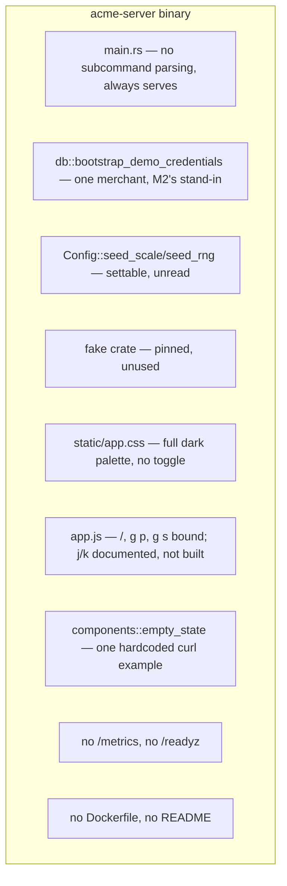
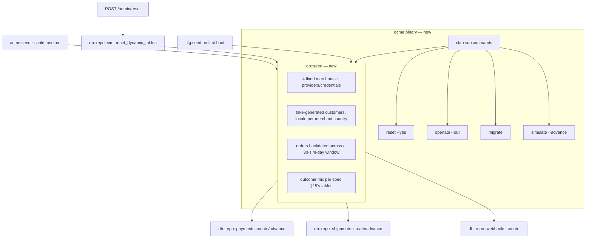
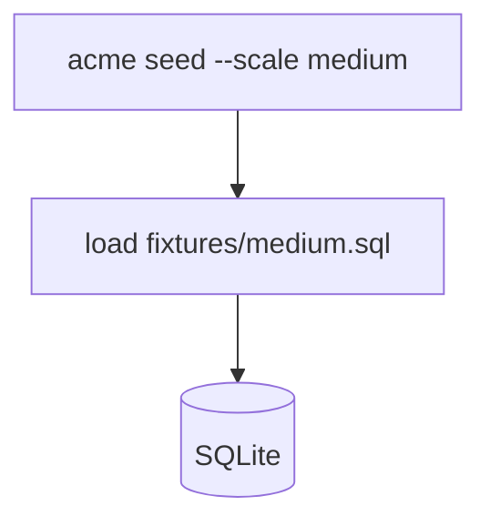

<!-- Instance of SPEC_TEMPLATE.md — see specs/SPEC_TEMPLATE.md -->

# Feature Spec: Seed and Polish (M7)

**Ticket Nº**: N/A — internal milestone, tracked as M7 in specs/000-Initial-Spec.md
§20

## Objective

Implement milestone **M7 — Seed and Polish** from specs/000-Initial-Spec.md
§20: the Faker-driven seed world and scale presets every prior milestone's
own spec deferred to "M7's job" (specs/004-Dashboard.md,
specs/006-Dialects.md, specs/008-Simulation.md all say this in nearly
those words), plus the CLI subcommands the `Justfile` has referenced since
M0 without an implementation, dark mode, keyboard shortcuts, empty-state
curl snippets, README, `.http` files, Docker, and `/metrics`.

Done when, per §20's own row: "fresh clone to a populated, moving
dashboard in one command" — `git clone && cargo run` (or `docker compose
up`) lands on a dashboard already showing four merchants' worth of
history with shipments still moving, not an empty seeded-nothing
instance.

### Details

In scope:

1. **The Faker seed world** (spec §15): `db::seed`, a new module building
   the four-merchant world spec §15 names verbatim — Café Aurora (ES/EUR,
   Iberex + Postalis, Chargeflow + Nordika), Tienda Andina (CL/CLP, Acme
   Ship, Trancorp Webpay), Livraria Beira (BR/BRL, ShipHub, Pago Rápido),
   Bici Ràpid (ES/EUR, Veloz, Acme Pay) — using `fake` (pinned since M0,
   unused until now, the same "reserved dependency" pattern `hmac`/
   `reqwest` were before specs/005-Webhooks.md and `serde_qs` still is
   for specs/007-Additional-Dialects.md's Chargeflow slice) with a fixed
   `StdRng` seeded from `Config::seed_rng`, so a given seed always
   produces the same database. Locale-aware generators
   (`fake::locales::ES_ES`/`PT_BR`) plus a hand-written Chilean
   name/RUT pool with a real check-digit algorithm (spec §15's own
   "because integrators validate them" — this is the one generator
   `fake` doesn't have out of the box).
2. **Scale presets** (`small`/`medium`/`large`, `Config::SeedScale`,
   already a settable enum since M1 with nothing reading it): `medium`'s
   volumes are spec §15's own worked numbers (4 merchants, ~180
   customers, 500 orders over 30 sim days with a realistic daily curve,
   560 payments, 430 shipments, 9 webhook endpoints — two deliberately
   failing — ~6 000 request-log rows); `small`/`large` scale every count
   proportionally off the same generation logic, not a separate
   generator per scale. Orders are backdated across the 30-sim-day
   window (not all created "now") so the seeded world already has a
   realistic outcome mix (78% captured, the exact decline/pending/
   refund/dispute split spec §15 tables) and ~15% of shipments still
   mid-transit when the seeder finishes — "live activity the moment it
   opens," not a museum.
3. **CLI subcommands** (spec §19): `acme` grows `serve` (default, today's
   only behavior), `seed --scale <small|medium|large>`, `reset --yes`,
   `openapi --out <dir>`, `migrate`, and `simulate --advance <duration>`
   (scripted demos — runs the ticker/seeder's own advancement logic
   without a live server). The `Justfile` has called
   `cargo run -p acme-server -- seed --scale {{scale}}` since before this
   milestone existed to make it work — this is that promise kept, not new
   scope invented for M7.
4. **`POST /admin/reset`** and `just reset`: truncates in FK order,
   `VACUUM`s, and reseeds (spec §15) — the same table list
   specs/008-Simulation.md's `db::repo::sim::reset_dynamic_tables`
   already established (children before parents, `sim_settings` left
   untouched), now feeding the real seeder instead of the one-merchant
   demo fixture `db::bootstrap_demo_credentials` was always meant to be a
   stand-in for.
5. **Dark mode**: `static/app.css` already ships the complete dark
   palette behind `prefers-color-scheme: dark` and a `[data-theme]`
   override hook (built ahead of schedule, unused until now) — this
   milestone adds the one missing piece, a rail toggle button that flips
   `data-theme="light"|"dark"` and persists the choice in
   `localStorage`, read back by `app.js` on load before first paint (to
   avoid a flash of the wrong theme).
6. **Keyboard shortcuts, finished**: spec §13.4 documents `j`/`k` row
   navigation alongside the `/`, `g p`, `g s` shortcuts `app.js` already
   has — `j`/`k` were never actually implemented; this milestone adds
   them (move focus between `<tr>` rows on any list page, `Enter` opens
   the focused row) and a `?`-triggered on-screen cheat sheet (a `<dialog>`
   listing every bound key, generated from the same small JS table the
   keydown handler itself switches on, so the sheet can't list a key
   that isn't actually bound).
7. **Empty-state curl snippets, made honest for a multi-dialect world**:
   `components::empty_state`'s curl parameter has been a single
   hardcoded Acme Pay/Acme Ship example since M3; specs/006-Dialects.md
   added a second payment dialect (Trancorp Webpay) and a second shipping
   dialect (Iberex) sharing those same unscoped `/payments`/`/shipments`
   list pages, so one hardcoded example is no longer honestly "the
   provider currently selected" for anyone using the second dialect of
   either kind. This milestone makes the snippet a small per-built-provider
   table (keyed the same way `/providers`' own capability rows are,
   specs/006-Dialects.md item 5) and shows one tab per built dialect
   rather than reverting to picking a single winner.
8. **`requests/*.http`**: one file per built dialect (already promised by
   every dialect milestone's own "Definition of done" item 8 — specs/006,
   specs/007 — and never actually written this session, since each of
   those specs scoped the `.http` file as part of that dialect's own
   slice but the implementation passes for 006 didn't get to it), plus
   `requests/scratch.http` for ad hoc calls copied from the traffic
   inspector's "Copy as .http" (specs/008-Simulation.md's own trimmed
   scope note — that button isn't built yet either, so this file starts
   empty with a header comment explaining what populates it once it is).
9. **`/metrics`, `/readyz`, and the ticker-lag alarm** (spec §16):
   Prometheus text format (hand-rolled — the metric set is small enough
   that a full client library is more ceremony than the four counters/
   histograms need: request counts and latency by provider/status class,
   webhook attempts/outcomes, ticker lag, SQLite busy-timeout hits);
   `/readyz` checks the pool and that `sqlx::migrate!` has nothing
   pending; the ticker's own tick loop (`sim::ticker::spawn`) starts
   comparing "how long did that tick actually take" against the
   multiplier's implied budget and publishes the delta both as a metric
   and — the dashboard-visible half — an amber clock-header state when
   sim time is falling behind.
10. **Structured tracing**: one span per request carrying
    `request_id`/`provider`/`merchant_id`/`route` (spec §16), and
    `ACME_LOG_FORMAT=json` switching `tracing-subscriber`'s formatter —
    the crate already depends on `tracing-subscriber` with no JSON
    feature/format switch wired yet.
11. **README, Dockerfile, `docker-compose.yml`**: the README opens with
    the sandbox-only warning spec §18 requires in its first paragraph
    (not buried), the three-line quick start from spec §19, and a link to
    each spec in `specs/` for anyone who lands here from a search engine
    rather than the repo's own history. The Dockerfile is multi-stage
    with `cargo-chef` dependency caching, a `debian:bookworm-slim`
    runtime, non-root user, `/data` volume, and a `HEALTHCHECK` against
    `/healthz` — under 60 MB per spec's own target. `docker compose up`
    adds a ~30-line `webhook-sink` echo-server container, pre-registered
    as a webhook endpoint against the seeded world, so a first-run demo
    shows real deliveries arriving without the user registering anything
    themselves.

Out of scope (never scheduled, or scheduled elsewhere): `acme-client`
and `acme-cli` — spec §22, tracked as its own M8 in §22.14's delivery-plan
delta, not part of this milestone despite the name-alike CLI subcommands
item 3 adds (those are flags on the existing `acme` server binary, not a
new crate). Anything from specs/007-Additional-Dialects.md or
specs/008-Simulation.md's own trimmed items (Compare/Replay/HAR/NDJSON
export, `/admin/traffic/*`, the six remaining dialects) — this milestone
seeds and polishes whatever has actually shipped by the time it runs, it
does not build any of those itself.

## Prior Art

specs/000-Initial-Spec.md §15 (the seed world's exact shape — merchants,
volumes, outcome mix), §16 (observability), §18 (the security posture the
README's warning paragraph quotes), §19 (CLI subcommands, Justfile,
Docker). specs/002-Core.md for `Config::seed_rng`/`seed_scale` and
`sim::ticker`, both already built with this milestone's consumer in mind.
specs/004-Dashboard.md, specs/006-Dialects.md, specs/008-Simulation.md —
each names M7 by name as the milestone that finishes what it deliberately
left unfinished (the Faker world, the empty-state snippets, the `.http`
files); this spec is the place all three of those deferrals land.

## Tech Stack

| Crate/asset | Role in M7 | Status |
|---|---|---|
| `fake` (`derive`, `chrono` features) | The seed world's generators | pinned since M0, first real use — same pattern as `hmac`/`reqwest` before M4, `serde_qs` still today |
| `clap` (derive) | CLI subcommand parsing (`serve`/`seed`/`reset`/`openapi`/`migrate`/`simulate`) | new dependency — nothing in the workspace pins a CLI-parsing crate yet |
| Hand-rolled Prometheus text formatter (`serde` not involved, plain `write!`) | `/metrics` | no new dependency — the exposition format is line-oriented plain text, not worth a client library for four metric families |
| `tracing-subscriber`'s `json` feature | `ACME_LOG_FORMAT=json` | already a dependency, feature not yet enabled |
| `cargo-chef` (Docker build stage only, not a Rust dependency) | Docker layer caching | new, Docker-only |

### Caveats

- The Chilean RUT check-digit algorithm is the one generator `fake`
  itself has no locale for — hand-written, small (modulo-11 over the
  digits, per the same rule real Chilean validators use), and unit
  tested against a handful of known-valid/known-invalid RUTs rather than
  trusted by construction.
- `simulate --advance <duration>` reuses `sim::ticker`'s own
  `tick_shipments`/`tick_payments` functions directly (already
  callable outside the background task — `sim::ticker`'s own tests
  already drive them this way) rather than spinning up a throwaway
  server and calling itself over HTTP; a scripted demo gets the same
  advancement a running server's ticker would produce, just without
  needing a live process to advance sim time against.
- `/metrics` and `/readyz` are unauthenticated, matching the dashboard's
  own posture (spec §18) — this is a sandbox; there is no merchant-facing
  reason either endpoint would need to hide anything, and gating them
  behind auth would break the `HEALTHCHECK` line in the Dockerfile item
  11 adds.
- The empty-state snippet table (item 7) only lists dialects that are
  actually mounted (`db::repo::providers::list`'s own rows, the same
  query specs/006-Dialects.md's `/providers` page already uses) — a
  fresh clone before specs/007-Additional-Dialects.md lands still shows
  exactly the four dialects this repository has today, not six
  placeholders for ones that don't exist yet the way `/providers`' own
  catalog table deliberately does.

### Future Improvements

Nothing is scheduled after M7 in specs/000-Initial-Spec.md's own §20 —
this is the last row of the original delivery plan. §22's `acme-client`/
`acme-cli` work (tracked as M8 by §22.14) is the only planned follow-on,
and it's an importable Rust crate generated from the OpenAPI specs this
milestone's own `.http` files and `openapi` CLI subcommand already
produce, not a dashboard or seed-data concern.

## Technical Details

### Current State

M2's `db::bootstrap_demo_credentials` was always explicit about being a
stand-in ("the full faker-driven world is M7's `seed` subcommand; this is
only the one merchant + one credential per reference provider that M2's
own demo needs" — its own doc comment). Every subsequent milestone's own
spec (004, 006, 008) repeated that deferral rather than re-deciding it.
This milestone is where those deferrals get cashed in, plus the
CLI/Docker/observability scaffolding no earlier milestone needed for
itself.

## Proposal/s

### Option A: One `db::seed` module driving both the CLI subcommand and `POST /admin/reset`, scaled by a single multiplier (chosen)

#### Introduction

`db::seed::run(pool, scale: SeedScale, rng_seed: u64, clock: &SimClock)`
is the one function that builds the world — called by the `seed` CLI
subcommand, by `POST /admin/reset` after truncation, and by
`db::bootstrap_demo_credentials`'s eventual replacement at first-boot
time (`cfg.seed` already gates this, unchanged). `small`/`medium`/`large`
map to a scale multiplier applied uniformly to spec §15's own `medium`
counts, rather than three independently maintained generation paths —
the four-merchant *cast* (Café Aurora, Tienda Andina, Livraria Beira,
Bici Ràpid) never changes size, only how many customers/orders/payments/
shipments each one gets.

#### Details

Payments/shipments seeded through the *same* `db::repo::payments::create`/
`advance` and `db::repo::shipments::create`/`advance` every real request
already goes through (not a bulk-insert bypass) — this is what makes the
seeded world's `payment_events`/`shipment_events`/`events` rows, and so
its webhook deliveries and traffic-inspector rows, come out looking
exactly like organic activity would have, rather than a special seeded
shape the dashboard has to render differently.

#### Testing Strategy

| Layer | Approach |
|---|---|
| RUT check digit | Table test against known-valid RUTs (with their real check digits) and known-invalid ones |
| `db::seed::run` determinism | `#[sqlx::test]`: the same `rng_seed` produces byte-identical merchant/customer name sets across two runs |
| Scale presets | `#[sqlx::test]`: `small`/`large` row counts scale proportionally to `medium`'s, without duplicating the generation function |
| Outcome mix | `#[sqlx::test]` over a `medium` seed: captured/rejected/pending/refunded/disputed payment ratios and delivered/in-flight/exception/returned/lost shipment ratios land within a tolerance band of spec §15's percentages |
| "Still moving" property | `#[sqlx::test]`: roughly 15% of seeded shipments have `next_transition_at` still in the seeded world's future relative to the sim clock at seed time |
| `POST /admin/reset` | `axum-test`: creates data via the API, resets, asserts the pre-reset resource ids 404 and the post-reset world matches a fresh `seed` run's row counts |
| CLI subcommands | Each subcommand gets a small integration test invoking the binary's `run_cli`-equivalent entry point directly (not a subprocess) and asserting on its effect (files written for `openapi`, row counts for `seed`, clean exit for `migrate` against an already-current database) |
| `/metrics`/`/readyz` | `axum-test`: `/readyz` 200s against a migrated pool, 503s if migrations are deliberately left pending in the test fixture; `/metrics` output parses as valid Prometheus text exposition format |
| Ticker lag | Unit test: a `tick_shipments` call artificially slowed past its budget increments the lag metric; the dashboard's clock-header amber state test asserts it flips only past the same threshold |
| Dark mode toggle | `axum-test`/snapshot: the rail's toggle control exists on every page; a unit test on the `app.js` logic (via a lightweight DOM test, or a documented manual-check step if no JS test runner exists yet) that `data-theme` persists across a reload |
| `j`/`k` shortcuts, cheat sheet | Documented manual verification step (this codebase has no browser-driven JS test harness) plus a static assertion that the cheat sheet's key list and the keydown handler's `switch`/`if` cases stay in the same generated table, so they can't diverge silently |

#### Acceptance Criteria

| | |
|---|---|
| Given | A completely fresh clone with no `acme.db` |
| When | Someone runs `cargo run` (or `docker compose up`) and opens the dashboard |
| Then | All four merchants' payments/shipments are visible immediately, roughly 15% of shipments are still advancing on their own within the next few ticks, at least one seeded webhook endpoint is visibly failing (spec §15: "one returns 500 always, one times out"), and `/providers` shows real per-dialect credentials for every merchant's registered providers |
| And | `just reset` (or `POST /admin/reset`) reproducibly returns to an equivalent freshly-seeded state, and `ACME_SEED_RNG` set to the same value on two separate fresh clones produces the same merchant/customer names both times |

#### Open Questions / Risks

##### Should seeded payments/shipments go through the same state-machine/repo calls real traffic uses, or a faster bulk-insert path?

The same calls. `medium`'s ~1000 combined payment/shipment rows (560 +
430) each producing a handful of `advance()` calls is not a performance
problem worth a parallel bulk-insert code path, and the alternative means
maintaining two ways to reach every `payments`/`shipments` row shape —
exactly the "one implementation" property spec §5's repo rule and this
project's own established pattern (specs/005-Webhooks.md's fan-out,
specs/008-Simulation.md's reset) both already lean on. A bulk path would
also need its own webhook fan-out/traffic-capture reasoning to make the
seeded world look organic; reusing the real calls gets that for free.

##### Does `simulate --advance <duration>` need its own HTTP server, or can it run headless?

Headless. It opens the same `SqlitePool` a `serve` run would, builds a
`SimClock` already jumped by the requested duration, and calls
`sim::ticker::tick_shipments`/`tick_payments` in a loop until nothing
advances further — exactly what the background ticker does per wall
second, just driven synchronously instead of on a timer. No HTTP is
involved because nothing about advancing simulated time requires a
request/response round trip; `serve` remains the only subcommand that
binds a port.

##### Why hand-roll `/metrics` instead of using a Prometheus client crate?

Four metric families (request counts/latency, webhook outcomes, ticker
lag, busy-timeout hits) is a small, fixed set that doesn't grow every
milestone the way the dialect count does — a client crate's registry/
label-cardinality machinery earns its cost on a metrics surface that
grows organically over a project's life, which this one is not expected
to; a few `AtomicU64`s and histogram buckets behind one `/metrics`
handler that formats them is less code than wiring a registry would be.

### Option B: A separate, hand-authored fixture file per scale instead of a generator (rejected)

#### Introduction

Ship `fixtures/small.sql`/`medium.sql`/`large.sql` — pre-computed,
checked-in SQL dumps of each scale's seeded world, loaded by `seed`
rather than generated at seed time.

#### Details

#### Testing Strategy

A checksum test per fixture file instead of Option A's determinism/
outcome-mix/scale tests — there is nothing to test generation logic
*for*, since there is none; the fixture is either present and loads or it
isn't.

#### Acceptance Criteria

| | |
|---|---|
| Given | A contributor changes `Config::seed_rng`'s default, expecting a differently-seeded world |
| When | They run `just seed` |
| Then | Nothing changes — the fixture file doesn't read `seed_rng` at all, because it was generated once, checked in, and is now just a static blob |

#### Open Questions / Risks

##### Why was this rejected?

Because it silently breaks the exact promise spec §15 opens with — "so
the same `ACME_SEED_RNG` always produces the same database" describes a
*generator* keyed by the seed, not a fixture indifferent to it — and
because a checked-in SQL dump of ~1000+ rows across a dozen tables is
itself a maintenance burden every future schema migration has to keep in
sync by hand, which a generator sidesteps by construction (it always
matches the schema it was just run against, the same reasoning
`db::bootstrap_demo_credentials` already relies on today).
