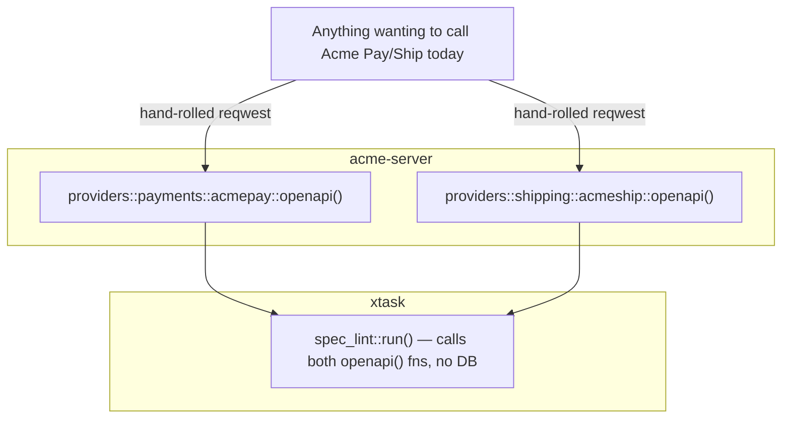
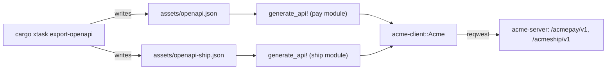
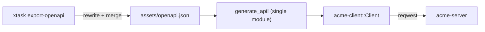

<!-- Instance of SPEC_TEMPLATE.md — see specs/SPEC_TEMPLATE.md -->

# Feature Spec: Acme Client (M8, partial)

**Ticket Nº**: N/A — internal milestone, tracked as M8 in spec §22 (the
phantom `specs/000-Initial-Spec.md` every other spec in this repo cites by
that filename no longer exists under that name — the sections survive only
as cross-references in `specs/x1-Scaffolding.md`, `specs/x3-First-Vertical-Slice.md`
and `specs/x9-Seed-and-Polish.md`). Those three specs agree on the shape:
`acme-client` is "an importable Rust crate generated from the OpenAPI
specs" (x9, §194-200), scoped to depend only on M2 and M4 (x3, §22.14),
and deliberately *not* started in M2 "because §22.3's four
generator-friendliness rules are cheapest to enforce while there are only
two providers to fix" (x3's Caveats) — `cargo xtask spec-lint` (M2) is
that enforcement; this spec is the payoff.

## Objective

Ship `crates/acme-client`: a `reqwest`-based Rust client for **ACME's own
API surface** — Acme Pay (`/acmepay/v1`) and Acme Ship (`/acmeship/v1`),
the two "house style" reference dialects `specs/x3-First-Vertical-Slice.md`
built end to end — generated from a committed OpenAPI document
(`assets/openapi.json`) via `progenitor`, so the client can never drift
from what the server actually serves without the drift being visible in
a diff.

Done when: `assets/openapi.json` is committed and reproducible by one
command; `crates/acme-client` compiles as a normal workspace member with
no hand-written request/response types for any Acme Pay/Acme Ship
operation; and a smoke test against a running `acme-server` (spun up the
same way `tests/scenarios.rs` already does) completes one payment and one
shipment round trip through the generated client, not raw `reqwest`.

### Details

In scope:

1. **`assets/openapi.json`**: the *combined* Acme Pay + Acme Ship document
   — the same merge `http::openapi::router` already builds for the "All
   providers" Swagger UI entry, minus Trancorp Webpay and Iberex Express.
   Those two are excluded on purpose (see Open Questions below): they are
   third-party dialects ACME's sandbox *emulates* for realism, not ACME's
   own API, so a client generated from them would be a Trancorp/Iberex
   client wearing an `acme-client` label.
2. **`cargo xtask export-openapi`**: a new `xtask` subcommand,
   sibling to `spec-lint`, that calls
   `acme_server::providers::payments::acmepay::openapi()` and
   `acme_server::providers::shipping::acmeship::openapi()` (the same
   state-free constructors `spec-lint` already calls — no DB pool, no
   running server needed), merges them, and writes pretty-printed JSON to
   `assets/openapi.json` (path overridable with `--out`). `spec-lint`
   should still gate CI *before* export ever runs — a spec that fails
   spec-lint (missing `operation_id`, inline anonymous schema, undescribed
   field) is exactly the spec `progenitor` generates the ugliest client
   from, so linting first is the whole point of pulling §22.3 into M2
   early.
3. **`crates/acme-client`**: one `lib.rs` invoking `progenitor::generate_api!`
   against `assets/openapi.json`, plus a thin `Acme` wrapper the macro
   doesn't generate on its own — a single entry point holding one
   `progenitor`-generated `Client` per service (Pay, Ship), constructed
   from a base URL and bearer token, since the two services live at
   different path prefixes on the same host and `progenitor` generates
   one `Client` per spec document, not per tag.
4. **CI check that `assets/openapi.json` matches the server**: `just
   export-openapi && git diff --exit-code assets/openapi.json` (or the
   `xtask` equivalent), wired into `just lint` — the drift-check half of
   `spec §22.2`'s "spec-export/codegen/drift-check tool" x3 (§150-152)
   already named as M8's job for `xtask`.

Out of scope: Trancorp Webpay / Iberex Express clients (belong to a
future per-dialect-client spec if a real integration ever needs one —
nothing in this repo consumes them programmatically today); `acme-cli`
(the other M8 half, a separate spec); publishing `acme-client` to
crates.io or versioning it independently of the workspace; retries,
rate-limit backoff, or webhook-signature verification helpers (the
generated client is a thin transport — those are a follow-on, see Future
Improvements).

## Prior Art

`specs/x3-First-Vertical-Slice.md` §22.3/§22.14 (the generator-friendliness
rules this spec's client generation depends on, and the explicit decision
to defer `acme-client` itself to M8), `specs/x9-Seed-and-Polish.md`
(confirms nothing but `acme-client`/`acme-cli` is left after M7, and that
it's "an importable Rust crate generated from the OpenAPI specs"),
`crates/xtask/src/spec_lint.rs` (the existing state-free
`providers::*::openapi()` constructors this spec's exporter reuses
verbatim), `crates/acme-server/src/http/openapi.rs` (the combined-spec
merge this spec's exporter mirrors, minus two providers).

## Tech Stack

| Crate               | Role                                                                 | Status                                    |
| ------------------- | --------------------------------------------------------------------| ------------------------------------------|
| `progenitor`        | `generate_api!` macro — compiles `assets/openapi.json` into a typed `Client` at build time | new workspace dependency |
| `progenitor-client` | Runtime support types (`Error<E>`, `ResponseValue<T>`, etc.) the generated code references | new workspace dependency |
| `reqwest`           | Transport underneath the generated `Client`                          | already pinned (M0), reused as-is         |
| `serde`/`serde_json`| Request/response (de)serialization for generated types                | already pinned (M0)                       |
| `utoipa`            | `OpenApi::merge` for the combined document                           | already in use (`xtask`, M2)              |

### Caveats

- **`utoipa` 5 emits OpenAPI 3.1 only; `progenitor` 0.15 accepts 3.0.x
  only.** `xtask export-openapi` downgrades the document in place before
  writing it (3.1's `"type": ["T", "null"]` and nullable-`$ref`
  `oneOf`/`anyOf` become 3.0's `"nullable": true` sibling key, and
  `info.license.identifier` — a 3.1-only SPDX field — is dropped); it
  panics on any nullable shape it doesn't recognize rather than emitting
  a spec `progenitor` would silently misread. Confirmed empirically:
  every nullable field in both dialects is one of exactly these two
  shapes today.
- **A `required = false` header parameter typed `Option<String>` in an
  inline `params((...))` tuple double-counts optionality**: `utoipa`
  marks both the parameter `required: false` *and* its schema
  `nullable`, and `progenitor` turns that into `Option<Option<&str>>`
  with a `.to_string()` call on the inner `Option` that doesn't compile.
  Hit exactly once, on Acme Pay's `Acme-Idempotency-Key` header
  (`crates/acme-server/src/providers/payments/acmepay/routes.rs`) — fixed
  at the source annotation with `nullable = false` (the type is already
  `Option<...>`, so `required` alone already says everything the schema
  needs), never by patching the exported JSON. Confirms the Caveats'
  original prediction below, and is the reason to check the *source*
  `#[utoipa::path]`/`#[derive(ToSchema)]` shape first whenever
  `progenitor` rejects something spec-lint let through.
- `progenitor` generates one flat `Client` (plus one module per OpenAPI
  `tag`) from a single spec document; it does not generate a
  multi-service façade. Combining Acme Pay and Acme Ship into one
  generated `Client` (rather than two) would require merging their
  specs the same way `assets/openapi.json` already does for Swagger UI —
  rejected here (see Option A vs B) because the two services have
  distinct base paths (`/acmepay/v1` vs `/acmeship/v1`) and a merged spec
  would need every operation's path rewritten to carry the prefix, which
  `utoipa::openapi::OpenApi::merge` does not do (it unions `paths` as-is,
  assuming the caller mounts the whole document at one root — true for
  Swagger UI, which nests routers itself, but not true for a generated
  client hitting real absolute URLs).
- Acme Pay/Acme Ship schemas already pass `spec-lint`, so no inline
  anonymous schemas are expected — but `progenitor` has its own
  additional constraints (e.g. `oneOf` polymorphism support is partial,
  and it renames schemas that collide with Rust keywords or generated
  helper types). First `cargo check -p acme-client` after wiring the
  macro is expected to surface a small number of these; they are fixed
  by adjusting the *source* `#[derive(ToSchema)]` shape in `acme-server`
  (a rename or a `#[schema(rename = "...")]`), never by hand-patching
  `assets/openapi.json`, since the committed spec must stay a faithful,
  reproducible export.
- `progenitor`'s generated client has no concept of Acme Pay's bearer
  auth or idempotency header beyond what the spec's `security` block
  already declares (a header the caller must still set per-request via
  the generated builder — `progenitor` does not read
  `Authorization: Bearer …` from environment or config). Acme Pay/Ship
  credential management is left to the caller, matching how a real SDK
  consumer would use ACME's API today with raw `reqwest`.

### Future Improvements

A follow-on spec can add ergonomics `progenitor` doesn't generate:
automatic idempotency-key generation per mutating call, typed webhook
payload verification (reusing `acme-server`'s HMAC scheme so a client
integrator doesn't hand-roll signature checks), and retry/backoff for
`AcmeError::RateLimited`/`ProviderDown` responses. `acme-cli` (the other
M8 deliverable) would sit on top of this crate rather than talking to
`acme-server` directly.

## Technical Details

### Current State



Both reference dialects already expose a state-free `openapi()` document
constructor (used only by `spec-lint` today) and a fully `#[utoipa::path]`
-annotated, spec-lint-clean route surface. Nothing today serializes that
document to a file, and nothing consumes it as a client — every caller
(`tests/scenarios.rs` included) talks to `acme-server` with raw
`axum_test`/`reqwest` calls and hand-written request bodies.

## Proposal/s

### Option A: One `assets/openapi.json` (Acme Pay + Acme Ship merged), one `crates/acme-client` with two generated `Client`s behind a small `Acme` façade (chosen)

#### Introduction

Export a single combined spec (mirroring the existing Swagger UI
"All providers" merge, minus the two third-party dialects), but generate
*two* `progenitor::Client`s from it isn't possible from one document with
two base paths — so `acme-client` instead runs `generate_api!` twice
inside two private modules (`pay`, `ship`), each pointed at the same
`assets/openapi.json` but filtered... except `progenitor` has no
per-tag filtering built into the macro. Resolved by keeping **two**
committed spec files instead of one merged one — see Details.

#### Details

Corrected shape, after the filtering constraint above: `assets/openapi.json`
holds the Acme Pay document; `assets/openapi-ship.json` holds Acme Ship's.
`crates/acme-client/src/lib.rs` declares:

```rust
mod pay {
    progenitor::generate_api!(spec = "../../../assets/openapi.json");
}
mod ship {
    progenitor::generate_api!(spec = "../../../assets/openapi-ship.json");
}

pub use pay::Client as PayClient;
pub use ship::Client as ShipClient;

pub struct Acme {
    pub pay: PayClient,
    pub ship: ShipClient,
}

impl Acme {
    pub fn new(base_url: &str) -> Self {
        Self {
            pay: PayClient::new(&format!("{base_url}/acmepay/v1")),
            ship: ShipClient::new(&format!("{base_url}/acmeship/v1")),
        }
    }
}
```



`export-openapi` therefore writes both files in one run; "the combined
document" from the Objective becomes two sibling files under `assets/`
rather than one, which is the honest shape given `progenitor` generates
per-document, per-base-path clients.

#### Testing Strategy

- **Unit**: none needed inside `acme-client` itself — it is generated
  code plus ~15 lines of façade; nothing there has branching logic worth
  a unit test beyond "does it compile," which `cargo check` already
  proves every build.
- **Integration**: a new `tests/client.rs` in `acme-server` (workspace
  members can dev-depend on sibling crates), spinning up the real app
  the way `tests/scenarios.rs` does, pointed at by an `Acme` client
  instance, driving one `pay.create_payment(...)` → capture and one
  `ship.create_shipment(...)` → label round trip, asserting on the typed
  response structs `progenitor` generated rather than raw JSON.
- **CI drift check**: `just export-openapi && git diff --exit-code
  assets/openapi.json assets/openapi-ship.json`, run in the same CI job
  as `spec-lint`, immediately after it.

#### Acceptance Criteria

| Given | When | Then | And |
| --- | --- | --- | --- |
| `assets/openapi.json` and `assets/openapi-ship.json` are committed | `cargo xtask export-openapi` is run again against unchanged `acme-server` source | both files are byte-identical to what's committed | CI's drift check passes |
| `crates/acme-client` is added to the workspace | `cargo check --workspace` is run | it compiles with zero hand-written request/response types for Acme Pay or Acme Ship operations | `cargo xtask spec-lint` still passes unmodified |
| A merchant's bearer token and the sandbox base URL are available | `Acme::new(base_url)` is constructed and `pay`/`ship` methods are called with the token set on each request | the generated client produces the same HTTP requests `tests/scenarios.rs`'s raw calls do today | responses deserialize into `progenitor`-generated structs matching the OpenAPI schemas one-for-one |
| A schema in `acme-server` changes shape (e.g. a field renamed) | `cargo xtask export-openapi` is run and the diff is committed | `crates/acme-client`'s generated types change to match, with no manual edit | any caller code using the renamed field fails to compile until updated — drift is a compile error, not a runtime surprise |

#### Open Questions / Risks

### Should Trancorp Webpay and Iberex Express be included in `acme-client`?

No. They're dialects ACME's sandbox emulates to let *merchants* test
against a Chilean/Spanish provider's own API shape (spec §10.2/§11.2) —
calling them isn't "using ACME's API," it's ACME pretending to be someone
else's API for testing purposes. A client for those would belong to
whoever integrates against the real Trancorp/Iberex, not to `acme-client`.
Excluded from `assets/openapi.json` accordingly; revisit only if a
concrete consumer needs to test against the simulated third-party shape
programmatically.

### Why two spec files instead of one merged `assets/openapi.json`?

Explored merging (Option B) — rejected because `progenitor` has no
built-in way to generate two independently-based-URL clients from tags
within one document, and rewriting every path with its service prefix
before merging would make the committed spec diverge from what
`/openapi/acmepay.json`/`/openapi/acmeship.json` actually serve at
runtime, defeating the "never drift" goal the whole feature exists for.
Two files, each a byte-for-byte export of what the server already
serves at its own `/openapi/{acmepay,acmeship}.json` endpoint, keeps the
committed artifact and the live server's output provably identical.

### Option B: Merge Acme Pay and Acme Ship into one spec, rewrite paths with service prefixes, generate a single `Client` (rejected)

#### Introduction

Produce exactly one `assets/openapi.json` (matching the Objective's
original wording literally) by prefixing every Acme Pay path with
`/acmepay/v1` and every Acme Ship path with `/acmeship/v1` before
merging, then generate one `progenitor::Client` covering both services
against a single base URL.

#### Details



#### Testing Strategy

Same shape as Option A's, minus the two-file drift check (one file
instead).

#### Acceptance Criteria

Same shape as Option A's Acceptance Criteria table, with a single
`assets/openapi.json` in every row.

#### Open Questions / Risks

Rejected primarily because the rewritten, merged document would no
longer be identical to anything `acme-server` actually serves at
runtime (neither `/openapi/acmepay.json`/`/openapi/acmeship.json` nor the
already-existing `/openapi/acme.json` "All providers" combined doc, which
also includes Webpay/Iberex and doesn't prefix paths, since Swagger UI's
router nests them instead). A hand-rewritten spec that exists only to
feed `acme-client` is exactly the kind of drift-prone artifact this
feature is meant to eliminate — Option A's two untouched, server-matching
files were chosen instead.
