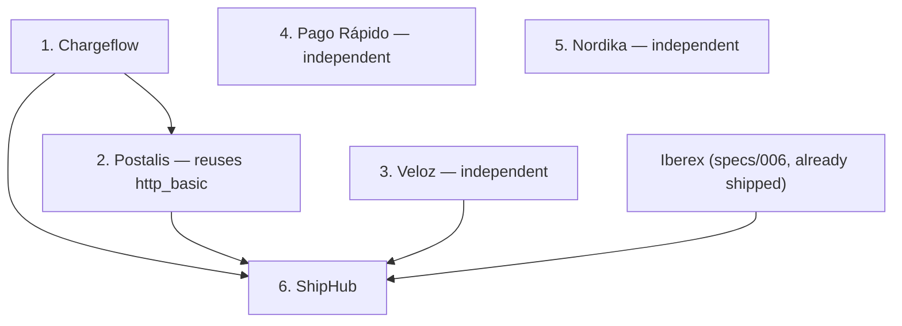
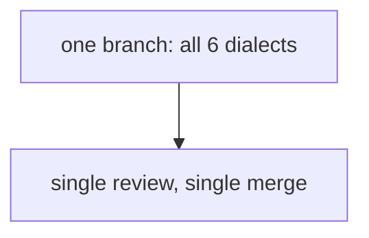

<!-- Instance of SPEC_TEMPLATE.md — see specs/SPEC_TEMPLATE.md -->

# Feature Spec: Additional Dialects (M5, remainder)

**Ticket Nº**: N/A — the rest of internal milestone M5 in
specs/000-Initial-Spec.md §20, after specs/006-Dialects.md peeled off a
first slice (Trancorp Webpay + Iberex Express)

## Objective

Extend the pattern specs/006-Dialects.md proved — one module per dialect,
one auth scheme per genuinely new auth kind, one `SigningScheme` variant
per genuinely new webhook-signing kind — to the **six remaining
dialects** §20 scopes for M5: **Pago Rápido**, **Chargeflow**, **Nordika
Pay** (payments, §10.3–§10.5), and **Postalis**, **ShipHub**, **Veloz**
(shipping, §11.3–§11.5).

This spec is intentionally lighter than specs/006-Dialects.md: the
module shape, middleware stack, OpenAPI/spec-lint registration, and
testing shape are already decided and proven there. What follows is,
per dialect, the delta from that proven shape — what's genuinely new,
what auth/signing work it needs, and what order dependencies constrain
it — not a re-derivation of conventions specs/006 already settled.
Treat each numbered section below as its own unit of work, landable
independently except where a dependency is called out.

Read this alongside specs/000-Initial-Spec.md's own sections for each
dialect (cited per section below) — this spec does not reproduce their
JSON examples; specs/006-Dialects.md's Trancorp/Iberex sections show what
a dialect's own spec slice looks like once written up at that level of
detail, and each of the six sections below should eventually be split
into its own spec of that shape immediately before implementation,
mirroring how specs/006 itself was split off from this milestone's
original single-file draft.

### Details

Conventions established by specs/006-Dialects.md, assumed throughout:

- Module shape: `src/providers/{payments,shipping}/{slug}/{dto,map,routes,mod}.rs`,
  three-function `mod.rs` pattern (`router()`, `openapi()`, `build(state)`),
  capture→auth→idempotency middleware layering, one `#[derive(OpenApi)]`
  struct per dialect.
- `domain::scenario`'s magic-value tables and `sim::pricing::quote` are
  reused unmodified by every dialect below that needs them — no dialect
  gets its own copy.
- Every new auth scheme is one addition to `http::auth`, reused verbatim
  by any later dialect that happens to share it (already true of
  `bearer_auth`, reused by Pago Rápido and ShipHub below with zero new
  code).
- Every new `domain::webhook::SigningScheme` variant is one addition to
  that enum, per specs/005-Webhooks.md's "one variant on purpose, M5 adds
  the rest one at a time" design.
- `xtask::spec_lint` and `requests/{slug}.http` grow by one entry per
  dialect, same as specs/006's own item 1.

Suggested build order (dependency-driven, not difficulty-driven — ShipHub
is otherwise no harder than the rest, it just needs three siblings to
exist first):

1. **Chargeflow** (§10.4) — `src/providers/payments/chargeflow/`.
   New: `serde_qs` (pinned since M0, first real use) parses form-encoded
   bracket-notation bodies (`line_items[0][price_data][unit_amount]=…`)
   in non-strict mode; `http_basic` auth (new `http::auth` scheme, also
   reused by Postalis below); `SigningScheme::Chargeflow` — literally
   `SigningScheme::Acme`'s `{t}.{raw_body}` hex-HMAC formula under a
   different header name, so this is the moment `header_name()` moves
   from a hardcoded match arm to a field on the variant, not a new
   formula; a second `v0` signature alongside `v1` for endpoints that opt
   in (§10.4 — exercises a _client's_ multi-scheme handling, not
   independently verified beyond parsing, same caveat specs/006 flagged
   for anything client-side-only). Hosted page: `/chargeflow/c/pay/{cs_id}`
   reuses the same look as `/acmepay/c/{cs_id}` (both are Stripe/Acme-shaped
   Checkout Sessions) — but `/acmepay/c/{cs_id}` itself no longer waits on
   this item. `web::mod::hosted_checkout_placeholder`'s Acme Pay path got
   its own real page ahead of this slice
   (openspec/changes/acmepay-hosted-checkout, ADDED Requirements in
   `specs/acmepay-hosted-checkout/spec.md`), scoped to Acme Pay only —
   Chargeflow's own page is still this item's job.
2. **Postalis** (§11.3) — `src/providers/shipping/postalis/`. New:
   reuses `http_basic` from item 1, plus `X-Postalis-Cliente` as an extra
   required header the middleware checks alongside the Basic credential;
   two-phase pre-registration→label-confirm choreography
   (`codigoEnvio`/`localizador`, structurally similar to Webpay's
   create→commit from specs/006 but not identical — a confirm here
   _generates_ the label rather than just changing state, so don't
   collapse the two dialects' choreographies into one shared helper);
   numeric `codigoEstado` tracking with Spanish descriptions; locker
   (`CITYPAQ`) destinations skip `delivery_attempted` entirely (one
   branch in `map.rs`'s status translation, not a state-machine change —
   `domain::shipment`'s own transition table is untouched, this dialect
   just never emits the `AttemptDelivery` command for locker
   destinations). No `SigningScheme` variant: outbound "signing" is HTTP
   Basic using the endpoint's own stored credentials, so this dialect's
   webhook dispatch carries an `Authorization` header instead of a
   signature header — `dashboard::dispatcher`'s send path needs a small
   branch for "scheme has no signature, send Basic instead," which is new
   code in the dispatcher, not just a new `SigningScheme` match arm.
3. **Veloz** (§11.5, invented) — `src/providers/shipping/veloz/`. New:
   `hmac_request` auth (`X-Veloz-Key` + `X-Veloz-Signature`, HMAC-SHA256
   over `method + "\n" + path + "\n" + sha256(body)` — request-signing,
   distinct from and unrelated to `domain::webhook`'s outbound signing);
   `SigningScheme::Veloz` for its own outbound webhooks (same `{t}.{
raw_body}` hex-HMAC formula as Chargeflow's, different header name —
   zero new formula code, same variant-field pattern); time-window
   booking and an assigned courier whose `posicion` the ticker
   interpolates in a straight line from origin to destination with
   jitter (a new, small, pure function — deterministic for a fixed seed,
   same testing shape as `domain::shipment::happy_path_schedule`); OTP/
   photo proof of delivery. Pricing is **not** a `sim::pricing` tariff
   table — Veloz is time/distance-based, not zone-matrix-based, so it
   gets its own small pricing function living in its own module, not a
   new entry in `sim::pricing`'s tariff array. Once this dialect exists,
   specs/004-Dashboard.md's deferred moving-dot sketch
   (`web::pages::shipments::detail_fragment`'s `veloz`-only branch,
   rendering `posicion` on the existing inline SVG route sketch via the
   same SSE feed every other shipment update already uses) becomes
   buildable and should land in the same unit of work — there is nothing
   to render a moving dot for before this dialect exists.
4. **Pago Rápido** (§10.3) — `src/providers/payments/pagorapido/`. New:
   `preference`→`init_point` checkout creation; PIX and boleto non-card
   methods, each with its own fake payer page (PIX's "Pay now" button,
   the boleto PDF with a barcode and 3-day expiry) alongside the method
   chooser at `/pagorapido/checkout?pref_id=…` (§13.7); decimal
   `unit_price` parsed to minor units with an explicit rounding rule,
   rejected outright on excess precision (a real validation path, not
   silent truncation — same "never a silent truncation" rule
   `domain::money::Money::checked_add`/`checked_sub` already models);
   timezone-offset timestamps (`-03:00`, not `Z` — a formatting-only
   concern in `dto.rs`, `domain`'s own timestamps stay UTC internally);
   `SigningScheme::PagoRapido`, a genuinely different formula from every
   variant so far — the manifest string `id:{data.id};request-id:{rid};
ts:{ts};` rather than `{t}.{raw_body}`, so this is real new signing
   code, not a header-name variant on an existing formula; thin webhook
   bodies (`{data: {id}}`, no resource snapshot) mean
   `domain::webhook::build_envelope`'s `data.object` is just `{"id": …}`
   for this dialect specifically — document this as a deliberate,
   dialect-specific envelope shape, not a bug to reconcile with every
   other dialect's full-snapshot envelope.
5. **Nordika Pay** (§10.5, invented) — `src/providers/payments/nordika/`.
   New: `oauth2_client_credentials` auth (`POST /oauth/token`,
   `grant_type=client_credentials` — a two-line delta from specs/006's
   `oauth2_password`, differing only in which grant type and which
   credential fields the token exchange expects); a mandatory SCA
   redirect (`/nordika/sca/{order_id}`, §13.7 — a 6-digit code challenge,
   `123456` succeeds, the fourth and last hosted page this milestone
   needs); RFC 9457 (`application/problem+json`) error bodies, a new
   error-rendering path alongside `AcmeError`'s existing Stripe-shaped
   envelope — not a replacement for it, `AcmeError` stays what every
   other dialect uses; instalment plans; `SigningScheme::Nordika` — HTTP
   Signatures string, base64-encoded, the second genuinely new signing
   formula in this list (alongside Pago Rápido's) rather than a
   header-name variant. **`capture_mode: on_shipment`**, the one place
   payments and shipping couple: `sim::ticker::tick_shipments` gains one
   step after a shipment reaches `picked_up` — look up any `Captured`-
   bound Nordika payment whose `reference` matches the shipment's
   `external_ref` and, if `capture_mode == on_shipment`, issue the
   matching-amount `Capture` command through the same
   `domain::payment::apply` every other capture path already uses.
   Matched by reference-string equality, not a new `orders` table — the
   same reasoning specs/006's own Open Questions gave for keeping this
   milestone's scope bounded applies here unchanged.
6. **ShipHub** (§11.4) — `src/providers/shipping/shiphub/`, **last**,
   since it depends on Iberex (built in specs/006), Postalis, and Veloz
   (items 2–3 above) all existing first. New: plain `bearer_auth`, no new
   auth scheme; one rating call fans out _internally_ to Iberex's,
   Postalis's, Veloz's, and Acme Ship's own pricing functions — a
   same-process function call each, never a real HTTP request between
   them, so a ShipHub rate call produces exactly one inbound
   `http_exchanges` row through `capture::layer`, not four; every
   response wrapped in `{meta, data}`; no `SigningScheme` variant — its
   outbound "signing" is a `?token=` query parameter on the callback URL,
   which (like Postalis's HTTP Basic) needs the same small
   `dashboard::dispatcher` branch for "this scheme sends no signature
   header." A ShipHub quote and a direct Iberex/Postalis/Veloz quote for
   the same parcel must agree exactly, since both paths call the same
   underlying pricing function — this is the property specs/000 §11.4
   calls "a small touch that makes the sandbox feel coherent," and is
   worth its own integration test precisely because it's easy to
   accidentally break by letting ShipHub grow its own copy of a tariff
   number instead of calling the real function.

Also in scope, once the relevant dialect above lands (not independent
work — bundle each with its trigger):

- `/providers`' capability table (specs/006 item 5) gets a real row
  (replacing that placeholder `—`) as each dialect above ships, plus a
  new column filled in for `/providers/{slug}`'s status-mapping table
  (§11.6) once all four shipping dialects exist.
- `http::openapi`'s Swagger selector and `xtask::spec_lint` grow one
  entry per dialect, same mechanical addition specs/006's item 1
  described for its own two.

Out of scope, unchanged from specs/006-Dialects.md's own out-of-scope
list: the fault-rule engine and Simulator page (M6), public tracking
pages (M6), CL/BR/international `sim::pricing` zone matrices (still no
CL/BR dialect anywhere in the plan — every dialect through this spec
stays Spain/Brazil-payments-only, and Brazil only for Pago Rápido's
_payments_, not a shipping zone), traffic-inspector changes (§21.14 has
no M5 row).

## Prior Art

specs/000-Initial-Spec.md §10.3–§10.5 (Pago Rápido, Chargeflow, Nordika),
§11.3–§11.5 (Postalis, ShipHub, Veloz), §12.2 (the signing-scheme table
these six dialects finish), §13.6 (the veloz sketch), §13.7 (the three
remaining hosted pages), §10.6/§11.6 (the comparison tables `/providers`
finishes once these six exist). specs/006-Dialects.md for every
convention this spec assumes rather than re-derives, and for why Trancorp/
Iberex went first. specs/005-Webhooks.md for `SigningScheme`'s
extend-one-variant-at-a-time design, and for `dashboard::dispatcher`
being the place a no-signature scheme (Postalis, ShipHub) needs its
small branch.

## Tech Stack

| Crate/asset                     | Role                                                                                                                         | Status                                     |
| ------------------------------- | ---------------------------------------------------------------------------------------------------------------------------- | ------------------------------------------ |
| `serde_qs`                      | Chargeflow's bracket-notation form bodies                                                                                    | pinned since M0, first use is item 1 above |
| `hmac`, `sha2`, `hex`, `base64` | Every new `SigningScheme` variant and `hmac_request` (Veloz)                                                                 | already in use                             |
| No new crate for OAuth2         | `oauth2_client_credentials` is a two-line delta from specs/006's `oauth2_password` handler, not a new dependency             | n/a                                        |
| No new crate for RFC 9457       | Nordika's `application/problem+json` bodies are a `serde`-derived struct and a `Content-Type`, not a spec-compliance library | n/a                                        |

### Caveats

- This spec's six dialects are not equally sized. Pago Rápido and Nordika
  each add a genuinely new signing _formula_; Chargeflow and Veloz reuse
  Acme's formula under a new header name; Postalis and ShipHub add none.
  Don't budget them as six equal units — Pago Rápido and Nordika are each
  closer in size to specs/006's whole slice than to Postalis or ShipHub.
- `dashboard::dispatcher`'s "no signature, send Basic/query-token instead"
  branch (items 2 and 6) is new _dispatcher_ code, not new
  `SigningScheme` code — don't try to force Postalis/ShipHub into the
  `SigningScheme` enum with an empty-signature variant just to keep every
  dialect represented there; the enum should only hold dialects that
  actually sign something.
- Nordika's on-shipment capture coupling is the one piece of this spec
  that touches shared code (`sim::ticker`) rather than living entirely in
  its own module — land it carefully, with the "no matching payment
  reference is a no-op" test specs/006's own testing-strategy shape
  would call for, so a shipment ticking forward never silently captures
  the wrong payment.

### Future Improvements

Once all six dialects here exist, M6 (fault-rule engine, Simulator page,
public tracking pages) and M7 (dark mode, shortcut cheat sheet, empty-state
curl snippets) proceed exactly as specs/000-Initial-Spec.md §20 already
plans, unaffected by this spec's split from the original single-file M5
draft.

## Technical Details

### Current State

At the point this spec starts, specs/006-Dialects.md has shipped: four
providers exist (`acmepay`, `acmeship`, `webpay`, `iberex`), `http::auth`
has three schemes (`bearer_auth`, `header_key_pair`, `oauth2_password`),
`domain::webhook::SigningScheme` still has only `Acme`, `/providers` shows
four real rows and six placeholders, and exactly one hosted checkout page
(`/webpay/checkout`) is real.

## Proposal/s

### Option A: One dialect at a time, in the dependency order listed above, each its own reviewable unit (chosen)

#### Introduction

Same shape as specs/006-Dialects.md's own chosen option, scaled to six:
each dialect is its own module, its own PR-sized unit, adding only the
auth/signing primitives it specifically needs. The only ordering
constraint is ShipHub last (item 6's own dependency). Everything else is
independent and can land in any order, or in parallel across engineers,
once each one's own auth/signing prerequisites (if shared with an earlier
item in this list, e.g. Postalis's `http_basic` from Chargeflow) exist.

#### Details

#### Testing Strategy

Identical shape to specs/006-Dialects.md's own testing strategy, applied
per dialect: one auth-scheme test (where new), one `SigningScheme` unit
test against a hand-computed fixture (where new), one magic-value table
test, one `insta` snapshot integration test, plus each dialect's own
standout behavior (Chargeflow's bracket parsing round-trip, Postalis's
locker-skips-delivery_attempted branch, Veloz's interpolation
determinism, Pago Rápido's decimal-rounding rejection, Nordika's coupling
no-op case, ShipHub's cross-dialect price-agreement test).

#### Acceptance Criteria

|       |                                                                                                                                                                                                                                          |
| ----- | ---------------------------------------------------------------------------------------------------------------------------------------------------------------------------------------------------------------------------------------- |
| Given | specs/006-Dialects.md's four providers already shipped                                                                                                                                                                                   |
| When  | Each dialect in this spec lands                                                                                                                                                                                                          |
| Then  | It independently satisfies §20's "Definition of done for a provider" (all 8 items), appears in Swagger, passes `cargo xtask spec-lint`, and — once all six have landed — `/providers` shows ten real rows with no remaining placeholders |

#### Open Questions / Risks

##### Should Postalis and ShipHub's "no signature" outbound delivery really live in `dashboard::dispatcher` rather than `SigningScheme`?

Yes, per the Caveats note above. `SigningScheme` models _how a payload is
signed_; a dialect that signs nothing isn't a degenerate case of that —
it needs a different HTTP construction step (Basic auth header, or a
mutated callback URL) that has nothing to do with computing a signature.
Modeling it as a `SigningScheme::None` variant would make every match
over `SigningScheme` need a case that does something structurally
different from every other case, which is a sign it belongs one level up,
in the dispatcher's own per-attempt branch.

##### Does landing six dialects really need six separate specs eventually, as this document's own Objective suggests?

Only if the team wants specs/006-Dialects.md's level of pre-implementation
detail (full JSON examples, per-endpoint tables, two proposals) for each
one before writing code — reasonable for Pago Rápido and Nordika, given
their genuinely new signing formulas and (for Nordika) the ticker
coupling; probably unnecessary ceremony for Postalis and ShipHub, whose
"Details" sections above already say everything a two-proposal document
would. Treat the per-dialect sections above as sufficient for the smaller
four, and write a focused follow-up spec only for Pago Rápido and Nordika
if their own implementers want one.

### Option B: Build all six simultaneously behind one shared "remaining dialects" branch (rejected)

#### Introduction

Land all six dialects' modules, auth schemes, and signing variants in one
combined change, reviewed and merged together, rather than six
independent units.

#### Details

#### Testing Strategy

Same per-dialect tests as Option A, but none of them can be verified
green independently until the whole branch compiles — a failing test in
Nordika's coupling logic blocks reviewing Veloz's interpolation function,
even though the two share no code.

#### Acceptance Criteria

|       |                                                                                          |
| ----- | ---------------------------------------------------------------------------------------- |
| Given | The same six dialects as Option A                                                        |
| When  | A reviewer wants to approve just the Chargeflow module, which is ready first             |
| Then  | They cannot — the branch is all six or nothing, and the other five are still in progress |

#### Open Questions / Risks

##### Why was this rejected?

For the same reason specs/006-Dialects.md rejected building all five
remaining auth schemes ahead of a caller: it trades independent,
reviewable, individually-revertible units for a single large change with
no correctness or velocity benefit — §20's own "parallelizable" framing
for this milestone is a claim about independent units, and a single
combined branch is the one structure that claim doesn't survive.
